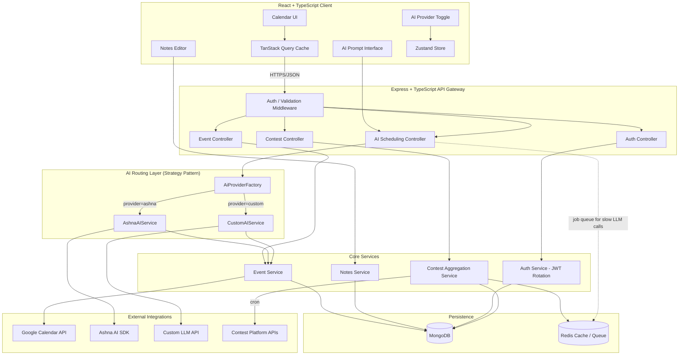
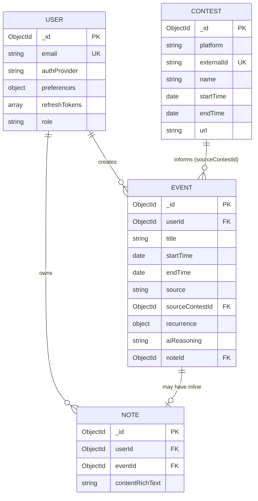
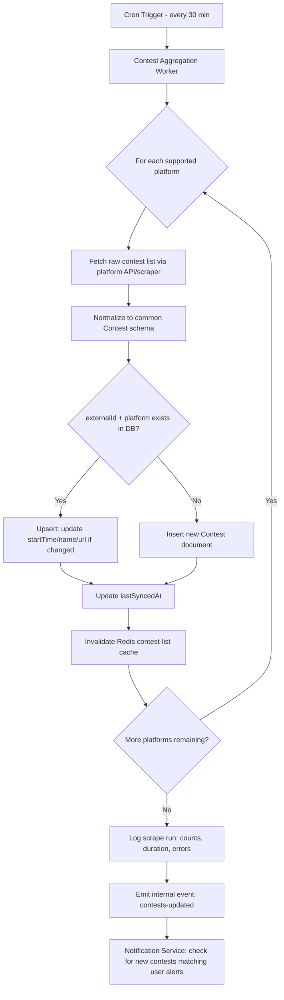
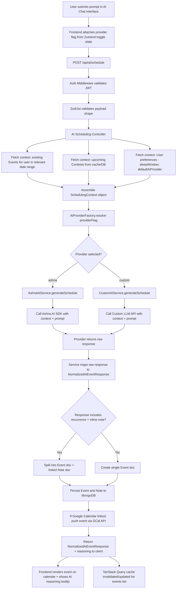
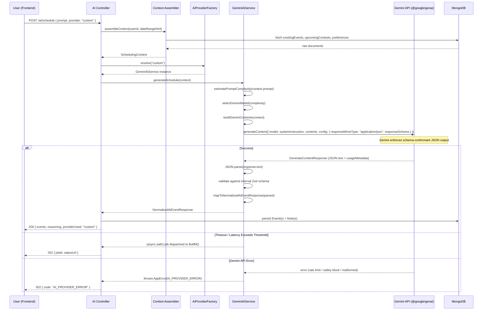

# CP Calendar Pro — Technical Documentation

**Stack:** MongoDB, Express.js, React, Node.js (MERN) + TypeScript
**Document Status:** Part 1 of 3 — Core Architecture & Requirements
**Timezone Standard:** IST (Indian Standard Time, UTC+5:30) enforced app-wide

---

# PART 1: CORE ARCHITECTURE & REQUIREMENTS

## 1. High-Level Design (HLD) Document

### 1.1 System Overview

CP Calendar Pro is a full-stack scheduling application purpose-built for competitive programmers. It aggregates upcoming contests from external platforms (Codeforces, LeetCode, CodeChef, AtCoder, etc.), and layers an AI scheduling agent on top of a traditional calendar/notes system. The defining feature is **context-aware dynamic scheduling**: the AI doesn't just create isolated events — it reasons over the user's existing calendar, fetched contest data, and stated preferences (e.g., "give me 7 hours of sleep, avoid overlapping contests") to propose or directly create calendar blocks.

The system supports two interchangeable AI backends, selectable per-user or per-request:

- **Ashna AI** — a managed/hosted AI SDK integration (proprietary or partner AI service).
- **Custom AI Agent** — a direct integration with a third-party LLM API (e.g., Anthropic, OpenAI-compatible endpoint) configured by the user or the platform.

Both are unified behind a normalized internal contract using the **Strategy Pattern**, so the rest of the application (calendar renderer, notification system, event store) never needs to know which provider generated a given event.

### 1.2 Core Components

| Component | Responsibility |
|---|---|
| **Client (React + TS)** | Calendar UI, chat-driven AI prompt interface, AI provider toggle, notes editor, auth flows |
| **API Gateway (Express + TS)** | Request validation, auth middleware, rate limiting, routing to services |
| **AI Routing Layer** | Strategy-pattern dispatcher: routes to `AshnaAIService` or `CustomAIService` implementations of a shared `IAiSchedulerProvider` interface |
| **Contest Aggregation Service** | Cron-driven scraper/fetcher pulling contest metadata from external APIs, normalizing and persisting to MongoDB |
| **Calendar/Event Service** | CRUD for events, recurrence expansion, conflict detection, Google Calendar sync |
| **Notes Service** | Inline notes attached to events/contests, supports rich text |
| **Auth Service** | JWT-based auth with access/refresh rotation, OAuth (Google) for Calendar API scope |
| **MongoDB** | Persistent store: Users, Contests, Events, Notes collections |
| **External Integrations** | Google Calendar API, Contest platform APIs/scrapers, Ashna AI SDK, Custom LLM API endpoint |

### 1.3 Technology Choices & Rationale

- **MongoDB** — Chosen for flexible schema evolution (AI-generated event metadata varies by provider), native support for nested preference documents, and horizontal scalability via sharding if contest/event volume grows.
- **Express.js + TypeScript** — Strict typing across DTOs, service interfaces, and Mongoose schemas reduces runtime errors in the AI routing layer, where payload shape divergence between providers is a real risk.
- **React + TypeScript** — Component-level type safety; paired with **TanStack Query (React Query)** for server-state caching (contests, events) and **Zustand** for lightweight client UI state (active AI provider, modal state, theme).
- **JWT with rotation** — Short-lived access tokens (15 min) + long-lived rotating refresh tokens (7 days, single-use, stored hashed) to balance UX and security.
- **Google Calendar API** — For two-way sync so AI-scheduled events appear in the user's native calendar ecosystem.
- **Strategy Pattern for AI routing** — Decouples business logic from AI vendor specifics; enables adding a third provider later without touching consumers of the scheduling service.
- **node-cron / Agenda.js** — For the recurring contest-scraping job, chosen over OS-level cron for portability across deployment environments and DB-backed job persistence (Agenda.js specifically, since it survives restarts).

### 1.4 Scalability Strategy

- **Stateless API layer** — Express servers hold no session state; horizontally scalable behind a load balancer.
- **Read-heavy caching** — Contest listings (low mutation frequency) cached in Redis with a TTL aligned to the scraper cron interval, reducing MongoDB read load.
- **Queue-based AI dispatch** — For high-latency AI calls (especially Custom AI Agent calls to third-party LLMs), requests are dispatched through a lightweight job queue (BullMQ/Redis) with WebSocket or polling-based result delivery, preventing HTTP timeout issues on slow LLM responses.
- **Database indexing** — Compound indexes on `Event.userId + Event.startTime`, `Contest.platform + Contest.startTime` for fast range queries (see Part 2, Section 4).
- **Horizontal scaling of scraper workers** — Contest aggregation decoupled into its own worker process so scraping load never contends with user-facing API request handling.

### 1.5 Security Strategy

- **Authentication:** JWT access/refresh rotation; refresh tokens stored hashed (bcrypt/argon2) in MongoDB with device/session metadata for revocation.
- **Authorization:** Role-based checks (`user`, `admin`) enforced via Express middleware on every protected route.
- **AI Provider Credential Isolation:** API keys for Ashna AI and Custom AI providers are never exposed client-side. The frontend sends only a `provider` flag; the backend injects the correct credential server-side.
- **Input Validation:** Zod or Joi schema validation at the controller layer for every mutating endpoint, including AI prompt payloads (to mitigate prompt-injection attempts from reaching provider APIs unsanitized).
- **Rate Limiting:** Per-user and per-IP limits on AI scheduling endpoints specifically, since these are the most expensive (cost + compute) operations in the system.
- **Google OAuth Scope Minimization:** Request only `calendar.events` scope, not full account access.
- **Transport Security:** HTTPS enforced end-to-end; HSTS headers; secure/httpOnly/sameSite cookies for refresh tokens.
- **Data-at-rest:** MongoDB encryption at rest (via managed Atlas or equivalent); sensitive preference fields (e.g., custom API keys, if user-supplied) encrypted at the application layer before persistence.

---

## 2. System Architecture Document

### 2.1 Architectural Style

CP Calendar Pro follows a **layered, service-oriented monolith** (not microservices at this stage) — a single deployable Node/Express backend internally organized into distinct service modules (Auth, Contest, Event, Notes, AI Routing). This is a deliberate choice: it avoids premature distributed-systems complexity while still enforcing strict internal boundaries via TypeScript interfaces, so the AI Routing and Contest Aggregation modules could later be extracted into standalone services with minimal refactor cost.

### 2.2 AI Routing Micro-Architecture (Strategy Pattern Detail)

The core abstraction is an interface implemented identically by both providers:

```typescript
interface IAiSchedulerProvider {
  generateSchedule(context: SchedulingContext): Promise<NormalizedAiEventResponse>;
}

interface SchedulingContext {
  userId: string;
  prompt: string;
  existingEvents: CalendarEvent[];
  upcomingContests: Contest[];
  preferences: UserPreferences; // includes defaultAiProvider, sleepWindow, timezone
}

interface NormalizedAiEventResponse {
  events: {
    title: string;
    startTime: string; // ISO 8601, IST-normalized
    endTime: string;
    recurrence?: RecurrenceRule;
    notes?: string;
    sourceContestId?: string;
  }[];
  reasoning?: string; // human-readable explanation, surfaced in UI
  providerUsed: 'ashna' | 'custom';
}
```

`AshnaAIService` and `CustomAIService` both implement `IAiSchedulerProvider`. A factory (`AiProviderFactory.resolve(providerFlag)`) selects the concrete implementation at request time based on the payload flag (or the user's `defaultAiProvider` preference if unspecified). This guarantees the Event Service, Notification Service, and frontend calendar renderer consume one single, stable shape regardless of which AI produced it.

### 2.3 Component Interaction Diagram



### 2.4 Cross-Cutting Concerns

- **Timezone Handling:** All timestamps stored in MongoDB as UTC (ISO 8601). Conversion to/from IST happens exclusively at the API boundary (request parsing) and client render layer, using `luxon` or `date-fns-tz` configured with a hard-coded `Asia/Kolkata` zone for this application (see SRS constraint 3.4.3).
- **Error Normalization:** All service-layer errors mapped to a shared `AppError` class with HTTP status + machine-readable code before reaching Express error middleware.
- **Observability:** Structured logging (pino/winston) tagged with `providerUsed` on every AI-routed request for cost/performance tracking per provider.

---

## 3. Software Requirements Specification (SRS)

### 3.1 Purpose & Scope

This SRS defines the functional and non-functional requirements for CP Calendar Pro, a competitive-programming-focused scheduling assistant. Scope includes contest aggregation, AI-assisted dynamic scheduling across two selectable providers, calendar/event management with Google Calendar sync, and inline note-taking.

### 3.2 User Roles

| Role | Description | Permissions |
|---|---|---|
| **Guest** | Unauthenticated visitor | View marketing/landing pages only |
| **User** | Standard authenticated user | Full CRUD on own events/notes, AI scheduling, contest viewing, provider toggle, Google Calendar linking |
| **Admin** | Platform operator | All User permissions + contest source management, user account moderation, system health dashboards |

### 3.3 Functional Requirements

**FR-1: Authentication & Account Management**
- FR-1.1: Users can register/login via email+password or Google OAuth.
- FR-1.2: JWT access tokens expire in 15 minutes; refresh tokens rotate on each use and expire in 7 days.
- FR-1.3: Users can link/unlink Google Calendar independently of primary auth method.

**FR-2: Contest Aggregation**
- FR-2.1: System fetches upcoming contests from supported platforms on a scheduled cron interval (default: every 30 minutes).
- FR-2.2: Contest data is normalized into a common schema regardless of source platform.
- FR-2.3: Duplicate contests (same platform + external ID) are upserted, not duplicated.

**FR-3: AI-Powered Dynamic Scheduling**
- FR-3.1: Users can submit a natural-language prompt to generate one or more calendar events.
- FR-3.2: The AI agent must incorporate the user's existing events and upcoming contests as context before generating a schedule (e.g., scheduling sleep blocks that don't overlap contests).
- FR-3.3: A single prompt can generate a recurring event with an attached inline note in one step (e.g., "Block 2 hours every weekday evening for DSA practice, note: focus on graphs this week").
- FR-3.4: Users can toggle between "Ashna AI" and "Custom AI Agent" via a persistent UI switch; the selection is sent with every AI scheduling request.
- FR-3.5: The selected provider is normalized server-side into a single event response shape before reaching the client.
- FR-3.6: Users can set a `defaultAiProvider` in preferences, used when no explicit per-request override is given.
- FR-3.7: AI-generated events must display a "reasoning" summary explaining scheduling decisions (e.g., "Moved sleep block to 11 PM–6 AM to avoid overlap with Codeforces Round 987").

**FR-4: Calendar & Event Management**
- FR-4.1: Full CRUD on events (manual and AI-generated).
- FR-4.2: Conflict detection warns users when a new event overlaps an existing one.
- FR-4.3: Two-way sync with Google Calendar for linked accounts.
- FR-4.4: Support for recurrence rules (daily, weekly, custom RRULE subset).

**FR-5: Notes**
- FR-5.1: Notes can be attached to events or standalone.
- FR-5.2: Notes support basic rich text (bold, italics, lists, code blocks — relevant for CP-specific content).

### 3.4 Non-Functional Requirements

- **NFR-1 (Performance):** AI scheduling requests must return within 8 seconds for Ashna AI (managed, low-latency) and within 20 seconds for Custom AI Agent (subject to third-party LLM latency), with async job-queue fallback beyond that.
- **NFR-2 (Availability):** 99.5% uptime target for core API; contest scraping failures must not degrade core calendar functionality (graceful degradation).
- **NFR-3 (Scalability):** Support at least 50,000 registered users and 10,000 concurrent WebSocket/polling connections without architectural changes.
- **NFR-4 (Security):** Compliance with OWASP Top 10 mitigations; no AI provider credentials ever transmitted to or stored on the client.
- **NFR-5 (Maintainability):** Strict TypeScript mode (`strict: true`) enforced repo-wide; no `any` types permitted in service/interface layers without explicit lint-disable justification.
- **NFR-6 (Usability):** AI Provider Toggle must be a single, discoverable, persistent control — not buried in settings — since it's a core differentiating feature.

### 3.5 Constraints

- **3.4.1:** MERN stack + TypeScript is mandatory; no framework substitutions (e.g., no Next.js SSR requirement at this stage).
- **3.4.2:** All AI provider integrations must conform to the shared `IAiSchedulerProvider` interface — no provider-specific logic may leak into controllers or the frontend.
- **3.4.3 (IST Timezone Enforcement):** All user-facing time displays, AI scheduling reasoning, and default scheduling windows (e.g., "sleep block", "evening practice") are computed and displayed in `Asia/Kolkata` (IST, UTC+5:30), regardless of server deployment region. UTC is used only for internal storage; IST conversion is enforced at every API response boundary via a shared serialization utility, not left to individual controllers.
- **3.4.4:** Google Calendar sync must respect the user's Google account's own timezone setting for the synced copy, while CP Calendar Pro's native UI remains IST-fixed — this dual-timezone edge case must be explicitly handled and tested.

---

**End of Part 1.**

---

# PART 2: DATA, API, & FLOW

## 4. Database Schema ERD Document

### 4.1 Collection Overview

| Collection | Purpose |
|---|---|
| `User` | Account, auth, and AI/scheduling preferences |
| `Contest` | Normalized contest data from external platforms |
| `Event` | Calendar events, both manual and AI-generated |
| `Note` | Rich-text notes, standalone or attached to events |

### 4.2 Schema Definitions

**User**
```typescript
interface User {
  _id: ObjectId;
  email: string;                 // unique, indexed
  passwordHash?: string;         // absent for OAuth-only accounts
  authProvider: 'local' | 'google';
  googleRefreshToken?: string;   // encrypted at rest
  createdAt: Date;
  updatedAt: Date;

  preferences: {
    defaultAiProvider: 'ashna' | 'custom';   // core toggle default
    customAiConfig?: {
      endpoint: string;
      apiKeyEncrypted: string;   // never returned to client in plaintext
      model: string;
    };
    sleepWindow: { start: string; end: string };  // "23:00"-"06:00", IST
    timezone: 'Asia/Kolkata';    // fixed per SRS 3.4.3, stored for explicitness
    notifyBeforeContestMins: number;
  };

  refreshTokens: {
    tokenHash: string;
    deviceId: string;
    issuedAt: Date;
    expiresAt: Date;
    revoked: boolean;
  }[];

  role: 'user' | 'admin';
}
```

**Contest**
```typescript
interface Contest {
  _id: ObjectId;
  platform: 'codeforces' | 'leetcode' | 'codechef' | 'atcoder' | string;
  externalId: string;            // platform's native contest ID
  name: string;
  startTime: Date;               // UTC
  endTime: Date;                 // UTC
  url: string;
  durationMinutes: number;
  fetchedAt: Date;
  lastSyncedAt: Date;
}
```

**Event**
```typescript
interface Event {
  _id: ObjectId;
  userId: ObjectId;              // indexed
  title: string;
  startTime: Date;               // UTC
  endTime: Date;                 // UTC
  source: 'manual' | 'ai-ashna' | 'ai-custom';
  sourceContestId?: ObjectId;    // ref Contest, if scheduling was contest-driven
  recurrence?: {
    freq: 'daily' | 'weekly' | 'custom';
    interval: number;
    byDay?: string[];            // e.g. ['MO','TU','WE']
    until?: Date;
  };
  aiReasoning?: string;          // populated only for AI-sourced events
  googleCalendarEventId?: string; // for two-way sync
  noteId?: ObjectId;             // ref Note, optional inline attachment
  createdAt: Date;
  updatedAt: Date;
}
```

**Note**
```typescript
interface Note {
  _id: ObjectId;
  userId: ObjectId;              // indexed
  eventId?: ObjectId;            // null if standalone
  contentRichText: string;       // serialized rich-text (e.g. TipTap/Slate JSON)
  createdAt: Date;
  updatedAt: Date;
}
```

### 4.3 Indexing Strategy

| Collection | Index | Rationale |
|---|---|---|
| `User` | `{ email: 1 }` unique | Fast login lookup, enforce uniqueness |
| `User` | `{ 'refreshTokens.tokenHash': 1 }` | Fast refresh-token validation/revocation |
| `Contest` | `{ platform: 1, externalId: 1 }` unique compound | Upsert dedup on scrape |
| `Contest` | `{ startTime: 1 }` | Range queries for "upcoming contests" widget and AI context fetch |
| `Event` | `{ userId: 1, startTime: 1 }` compound | Primary access pattern: "get user's events in date range" |
| `Event` | `{ userId: 1, source: 1 }` compound | Filtering AI- vs manually-created events in UI |
| `Note` | `{ eventId: 1 }` sparse | Fast lookup of notes attached to a given event |
| `Note` | `{ userId: 1, updatedAt: -1 }` | Standalone notes list, sorted recent-first |

### 4.4 Entity-Relationship Diagram



---

## 5. Data Flow Diagrams

### 5.1 Contest Scraping Cron-Job Process



### 5.2 Dynamic AI Event Scheduling Process



**Notes on the flow:**
- Steps G–I execute in parallel (`Promise.all`) to minimize latency before AI dispatch.
- If the Custom AI Agent path (N/P) exceeds the synchronous timeout window (NFR-1, ~20s), the request is instead pushed to the BullMQ job queue, and the client receives a `202 Accepted` with a job ID, polling `/api/ai/schedule/status/:jobId` until completion.
- The `providerUsed` field from `NormalizedAiEventResponse` is always persisted on the `Event.source` field for audit/analytics purposes, regardless of which path was taken.

---

## 6. API Documentation

Base URL: `/api/v1`
All authenticated routes require `Authorization: Bearer <accessToken>` header.
All request/response bodies are JSON. All timestamps in responses are IST-formatted strings (ISO 8601 with `+05:30` offset) per SRS constraint 3.4.3, converted server-side from UTC storage.

### 6.1 Auth

**POST `/auth/register`**
- Body: `{ email: string, password: string }`
- Response `201`: `{ user: UserPublic, accessToken: string }` (refresh token set as httpOnly cookie)
- Errors: `409 EMAIL_EXISTS`, `400 VALIDATION_ERROR`

**POST `/auth/login`**
- Body: `{ email: string, password: string }`
- Response `200`: `{ user: UserPublic, accessToken: string }`
- Errors: `401 INVALID_CREDENTIALS`, `429 RATE_LIMITED`

**POST `/auth/google`**
- Body: `{ idToken: string }` (Google OAuth ID token from client)
- Response `200`: `{ user: UserPublic, accessToken: string }`
- Errors: `401 INVALID_GOOGLE_TOKEN`

**POST `/auth/refresh`**
- Cookie: `refreshToken` (httpOnly)
- Response `200`: `{ accessToken: string }` (issues new rotated refresh cookie)
- Errors: `401 REFRESH_TOKEN_INVALID_OR_REVOKED`

**POST `/auth/logout`**
- Response `204`
- Effect: revokes current refresh token

### 6.2 Contests

**GET `/contests`**
- Query: `?platform=codeforces&from=2026-07-01&to=2026-07-31`
- Response `200`: `{ contests: Contest[] }`
- Cached: Redis-backed, 30-min TTL aligned to scrape cron

**GET `/contests/:id`**
- Response `200`: `{ contest: Contest }`
- Errors: `404 CONTEST_NOT_FOUND`

**POST `/admin/contests/refresh`** *(admin only)*
- Effect: manually triggers scrape cycle out-of-band
- Response `202`: `{ jobId: string }`

### 6.3 Notes

**POST `/notes`**
- Body: `{ contentRichText: string, eventId?: string }`
- Response `201`: `{ note: Note }`

**GET `/notes`**
- Query: `?eventId=<id>` (optional filter)
- Response `200`: `{ notes: Note[] }`

**PATCH `/notes/:id`**
- Body: `{ contentRichText: string }`
- Response `200`: `{ note: Note }`
- Errors: `403 NOT_OWNER`, `404 NOTE_NOT_FOUND`

**DELETE `/notes/:id`**
- Response `204`
- Errors: `403 NOT_OWNER`, `404 NOTE_NOT_FOUND`

### 6.4 Events

**GET `/events`**
- Query: `?from=2026-07-01&to=2026-07-31&source=ai-ashna`
- Response `200`: `{ events: Event[] }`

**POST `/events`** *(manual creation)*
- Body: `{ title: string, startTime: string, endTime: string, recurrence?: RecurrenceRule, noteContent?: string }`
- Response `201`: `{ event: Event }`
- Errors: `409 CONFLICT_DETECTED` (with `conflictingEventIds` in body — non-blocking warning, client may resubmit with `force: true`)

**PATCH `/events/:id`**
- Body: partial `Event` fields
- Response `200`: `{ event: Event }`

**DELETE `/events/:id`**
- Response `204`
- Effect: also removes linked Note if `cascadeNote: true` query param passed; also removes GCal-synced copy if linked

### 6.5 AI Scheduling

**POST `/ai/schedule`**
- Body:
```json
{
  "prompt": "Block 2 hours every weekday evening for DSA practice, note: focus on graphs this week",
  "provider": "ashna",
  "dateRangeHint": { "from": "2026-07-09", "to": "2026-07-16" }
}
```
- Response `200` (synchronous, Ashna-typical):
```json
{
  "events": [ { "title": "DSA Practice", "startTime": "...", "endTime": "...", "recurrence": {}, "notes": "Focus on graphs this week" } ],
  "reasoning": "Scheduled after your typical work hours, avoiding your 23:00-06:00 sleep window and the Codeforces Round 987 contest on Thursday.",
  "providerUsed": "ashna"
}
```
- Response `202` (async, Custom AI Agent exceeding sync threshold): `{ jobId: string, statusUrl: string }`
- Errors: `400 VALIDATION_ERROR`, `422 AI_PROVIDER_UNAVAILABLE`, `429 AI_RATE_LIMITED`, `502 AI_PROVIDER_ERROR`

**GET `/ai/schedule/status/:jobId`**
- Response `200`: `{ status: 'pending' | 'complete' | 'failed', result?: NormalizedAiEventResponse, error?: string }`

**PATCH `/users/me/preferences`**
- Body: `{ defaultAiProvider?: 'ashna' | 'custom', sleepWindow?: {}, customAiConfig?: {} }`
- Response `200`: `{ preferences: UserPreferences }`
- Note: `customAiConfig.apiKeyEncrypted` is write-only; never echoed back in responses.

### 6.6 Common Error Codes

| Code | HTTP Status | Meaning |
|---|---|---|
| `VALIDATION_ERROR` | 400 | Request body failed schema validation |
| `UNAUTHORIZED` | 401 | Missing/expired/invalid access token |
| `NOT_OWNER` | 403 | Resource exists but doesn't belong to requester |
| `NOT_FOUND` | 404 | Resource doesn't exist |
| `CONFLICT_DETECTED` | 409 | Event time overlap detected |
| `AI_PROVIDER_UNAVAILABLE` | 422 | Selected AI provider not configured/reachable |
| `RATE_LIMITED` | 429 | Too many requests within window |
| `AI_PROVIDER_ERROR` | 502 | Upstream AI SDK/LLM API returned an error |

---

**End of Part 2.**

---

# PART 3: UI, PLANNING, & STRUCTURE

## 7. UI / UX Design Document

### 7.1 Design Philosophy

CP Calendar Pro's interface should feel like a hybrid of a modern productivity calendar (Notion Calendar / Google Calendar polish) and a competitive-programming tool (dense information, fast keyboard-driven interactions). The AI Provider Toggle is treated as a first-class, always-visible control — not a settings checkbox — reflecting FR-3.4/NFR-6.

### 7.2 Color Palette

| Token | Hex | Usage |
|---|---|---|
| `--color-bg-primary` | `#0B0F19` | App background (dark mode default) |
| `--color-bg-surface` | `#141A29` | Cards, panels, modals |
| `--color-bg-elevated` | `#1C2333` | Popovers, dropdowns |
| `--color-accent-ashna` | `#7C5CFC` | Ashna AI branding accent (violet) — used on toggle, AI-generated event borders |
| `--color-accent-custom` | `#2DD4BF` | Custom AI Agent accent (teal) — used on toggle, distinguishes provider-sourced events at a glance |
| `--color-text-primary` | `#F4F5F7` | Primary text |
| `--color-text-secondary` | `#9AA3B2` | Secondary/meta text |
| `--color-success` | `#34D399` | Confirmations, synced states |
| `--color-warning` | `#FBBF24` | Conflict warnings |
| `--color-danger` | `#F87171` | Destructive actions, errors |
| `--color-contest-badge` | `#FB7185` | Contest event chips (visually distinct from user/AI events) |

Light mode uses inverted neutrals (`#FFFFFF` / `#F7F8FA` surfaces, `#1A1D24` text) with the same accent hues for consistency.

### 7.3 Typography

- **Primary typeface:** Inter (UI text — clean, highly legible at small sizes for dense calendar grids)
- **Monospace:** JetBrains Mono (used for contest names, note code blocks — nods to the CP audience)
- **Scale:** 12px (meta/labels) / 14px (body) / 16px (base) / 20px (section headers) / 28px (page titles), 1.5 line-height for body text, 1.2 for headers

### 7.4 Responsive Breakpoints

| Breakpoint | Width | Layout Behavior |
|---|---|---|
| `sm` | 0–639px | Single-column agenda view (month/week grid collapses to list); AI Chat becomes a bottom sheet |
| `md` | 640–1023px | Two-pane: calendar + collapsible side panel (contests/notes) |
| `lg` | 1024–1439px | Full three-pane: nav rail + calendar + persistent AI chat sidebar |
| `xl` | 1440px+ | Same as `lg` with widened calendar grid and denser event chips |

### 7.5 State Management Strategy

- **Zustand** — client-only, ephemeral UI state:
  - `aiProviderStore`: current toggle value (`ashna` | `custom`), persisted to `localStorage` for session continuity, hydrated into every AI request.
  - `uiStore`: modal visibility, active calendar view (day/week/month), sidebar collapse state.
- **TanStack Query (React Query)** — all server state:
  - `useEventsQuery(dateRange)` — keyed on `['events', userId, dateRange]`, background refetch on window focus.
  - `useContestsQuery(filters)` — long `staleTime` (~25 min) matching the 30-min scrape cron to avoid redundant fetches.
  - `useAiScheduleMutation()` — optimistic UI: pending AI event renders as a skeleton/pulsing chip on the calendar immediately on submit, replaced with the real event (and reasoning tooltip) on response; rolled back on error with a toast.
  - Async job polling (`useAiJobStatusQuery(jobId)`) uses `refetchInterval` with backoff for the Custom AI Agent's queued path.

### 7.6 Component Breakdown Per Page

**Layout Shell**
- `AppShell` — nav rail, top bar, theme toggle
- `NavRail` — Calendar / Contests / Notes / Settings icons

**Calendar Page**
- `CalendarGrid` — month/week/day renderer, drag-to-create
- `EventChip` — color-coded by `source` (manual/ai-ashna/ai-custom), shows conflict icon if applicable
- `EventDetailPopover` — edit/delete, shows `aiReasoning` if AI-sourced, linked note preview
- `ContestOverlayToggle` — show/hide contest blocks on the grid
- **`AiProviderSwitch`** *(detailed below)*
- `AiChatPanel` — prompt input, message history, streaming response indicator, "generating schedule…" state
- `ConflictWarningModal` — triggered on FR-4.2 overlap detection

**AI Provider Switch — Detailed Spec**
- A two-state segmented control, persistently docked at the top of `AiChatPanel` (and mirrored, compact, in the top bar for global visibility).
- States: `[ Ashna AI ]  [ Custom AI Agent ]`, active state filled with its accent color (`--color-accent-ashna` / `--color-accent-custom`).
- On change: writes to `aiProviderStore`, optionally calls `PATCH /users/me/preferences` if user checks "Set as default."
- Tooltip on hover explains the distinction: "Ashna AI — fast, managed. Custom AI Agent — bring your own LLM, may be slower."
- Disabled state (greyed, with lock icon) if `custom` selected but `customAiConfig` is unset — deep-links to Settings to configure.
- Accessibility: implemented as `role="radiogroup"` with `aria-checked`, full keyboard nav (arrow keys to switch, matching WAI-ARIA segmented-control pattern).

**Contests Page**
- `ContestList` — filterable by platform, sortable by start time
- `ContestCard` — countdown timer, "Schedule around this" quick action → pre-fills AI Chat prompt
- `PlatformFilterBar`

**Notes Page**
- `NotesList` — standalone + event-linked notes, searchable
- `NoteEditor` — rich text (TipTap), code block support for snippets
- `NoteEventLinkBadge` — shows and links to parent event if attached

**Settings Page**
- `AccountSection` — email, password change, Google link/unlink
- `AiPreferencesSection` — `defaultAiProvider` selector, `customAiConfig` form (endpoint, model, API key input — masked)
- `SchedulingPreferencesSection` — sleep window picker, contest notification lead time
- `SecuritySection` — active sessions list (from `refreshTokens`), revoke-device buttons

---

## 8. Project Plan Roadmap

### 8.1 Sprint Overview (2-week sprints, 8 sprints / 16 weeks total)

| Sprint | Weeks | Focus |
|---|---|---|
| 1 | 1–2 | Backend Foundation |
| 2 | 3–4 | Auth & Security Hardening |
| 3 | 5–6 | Contest Aggregation & External Integrations |
| 4 | 7–8 | AI Routing Layer (Strategy Pattern) |
| 5 | 9–10 | Frontend Foundation & Calendar UI |
| 6 | 11–12 | AI Chat UI, Provider Toggle, Notes |
| 7 | 13–14 | Google Calendar Sync, Conflict Detection, Polish |
| 8 | 15–16 | Testing, Deployment, Launch Prep |

### 8.2 Detailed Breakdown

**Sprint 1 — Backend Foundation (Weeks 1–2)**
- *What:* Scaffold Express + TypeScript backend, MongoDB connection, base project structure, CI pipeline.
- *How:* `tsconfig.json` in `strict: true` mode from day one (NFR-5); set up ESLint/Prettier; Mongoose schemas for User/Contest/Event/Note per Section 4.2; Docker Compose for local Mongo + Redis.
- *When:* Complete by end of Week 2, with a health-check endpoint deployed to a staging environment.

**Sprint 2 — Auth & Security (Weeks 3–4)**
- *What:* JWT access/refresh rotation, Google OAuth, rate limiting, input validation middleware.
- *How:* Implement `AuthService` with bcrypt/argon2 hashing, refresh token rotation logic (Section 1.5), Zod schemas per endpoint, `express-rate-limit` on auth + AI routes.
- *When:* Complete by end of Week 4; includes unit tests for token rotation edge cases (reuse detection, revocation).

**Sprint 3 — Contest Aggregation (Weeks 5–6)**
- *What:* Build scraper/fetcher adapters per platform, Agenda.js cron job, Redis caching layer.
- *How:* One adapter module per platform implementing a shared `IContestSource` interface; upsert logic per Section 4.3 indexing strategy; wire the Data Flow in Section 5.1.
- *When:* Complete by end of Week 6; validate against at least 2 live platforms (e.g., Codeforces + LeetCode) before moving on.

**Sprint 4 — AI Routing Layer (Weeks 7–8)**
- *What:* Implement `IAiSchedulerProvider`, `AshnaAIService`, `CustomAIService`, `AiProviderFactory`, BullMQ async job queue.
- *How:* Build the normalized response contract first (Section 2.2) and write both service implementations against it; mock the Ashna SDK if not yet available; implement the sync/async dispatch split (NFR-1 threshold logic) and the `/ai/schedule` + `/ai/schedule/status/:jobId` endpoints.
- *When:* Complete by end of Week 8; this is the highest-risk sprint — allocate buffer time if the Ashna SDK integration surfaces unknowns.

**Sprint 5 — Frontend Foundation & Calendar UI (Weeks 9–10)**
- *What:* React + TS scaffold, TanStack Query + Zustand setup, `CalendarGrid`, `EventChip`, base routing.
- *How:* Vite-based React TS template; implement design tokens from Section 7.2–7.3 as CSS variables/Tailwind config; build month/week/day calendar views with manual event CRUD wired to the API.
- *When:* Complete by end of Week 10; manual event creation/editing fully functional end-to-end.

**Sprint 6 — AI Chat UI, Provider Toggle, Notes (Weeks 11–12)**
- *What:* `AiChatPanel`, `AiProviderSwitch`, optimistic scheduling UX, `NotesList`/`NoteEditor`.
- *How:* Implement `AiProviderSwitch` per the detailed spec in Section 7.6; wire `useAiScheduleMutation` with optimistic updates and rollback; integrate TipTap for notes; connect inline-note-on-recurring-event flow (FR-3.3).
- *When:* Complete by end of Week 12; run informal usability pass on the toggle's discoverability (NFR-6).

**Sprint 7 — Google Calendar Sync, Conflict Detection, Polish (Weeks 13–14)**
- *What:* Two-way GCal sync, `ConflictWarningModal`, IST/GCal dual-timezone handling (constraint 3.4.4), visual/UX polish pass.
- *How:* Implement GCal push/pull with webhook or polling-based sync; conflict detection algorithm on event create/update; explicit test cases for the IST-fixed-UI vs GCal-account-timezone edge case.
- *When:* Complete by end of Week 14.

**Sprint 8 — Testing, Deployment, Launch Prep (Weeks 15–16)**
- *What:* End-to-end tests, load testing against NFR-3 targets, production deployment, monitoring/observability setup.
- *How:* Playwright/Cypress E2E suite covering both AI provider paths; k6 or Artillery load tests; deploy via CI/CD to production infra (e.g., Render/Railway/AWS); structured logging + dashboards per Section 2.4 observability notes.
- *When:* Complete by end of Week 16 — launch readiness review at the end of the sprint.

---

## 9. Project Structure Document

### 9.1 Backend (Node.js / Express / TypeScript)

```
backend/
├── src/
│   ├── config/
│   │   ├── env.ts                    # Typed env var loader/validator
│   │   ├── db.ts                     # MongoDB connection setup
│   │   └── redis.ts                  # Redis client (cache + BullMQ)
│   │
│   ├── models/
│   │   ├── User.model.ts
│   │   ├── Contest.model.ts
│   │   ├── Event.model.ts
│   │   └── Note.model.ts
│   │
│   ├── modules/
│   │   ├── auth/
│   │   │   ├── auth.controller.ts
│   │   │   ├── auth.service.ts       # JWT issuance/rotation logic
│   │   │   ├── auth.routes.ts
│   │   │   └── auth.validation.ts    # Zod schemas
│   │   │
│   │   ├── contests/
│   │   │   ├── contest.controller.ts
│   │   │   ├── contest.service.ts
│   │   │   ├── contest.routes.ts
│   │   │   ├── contest.cron.ts       # Agenda.js job definition
│   │   │   └── sources/              # Per-platform adapters
│   │   │       ├── IContestSource.ts
│   │   │       ├── codeforces.source.ts
│   │   │       ├── leetcode.source.ts
│   │   │       └── codechef.source.ts
│   │   │
│   │   ├── events/
│   │   │   ├── event.controller.ts
│   │   │   ├── event.service.ts      # CRUD, conflict detection, recurrence expansion
│   │   │   ├── event.routes.ts
│   │   │   └── googleCalendar.sync.ts
│   │   │
│   │   ├── notes/
│   │   │   ├── notes.controller.ts
│   │   │   ├── notes.service.ts
│   │   │   └── notes.routes.ts
│   │   │
│   │   └── ai/                        # ★ Strategy Pattern lives here
│   │       ├── ai.controller.ts
│   │       ├── ai.routes.ts
│   │       ├── ai.validation.ts
│   │       ├── IAiSchedulerProvider.ts        # Shared interface (Section 2.2)
│   │       ├── AiProviderFactory.ts           # Strategy resolver
│   │       ├── providers/
│   │       │   ├── AshnaAIService.ts          # Implements IAiSchedulerProvider
│   │       │   └── CustomAIService.ts         # Implements IAiSchedulerProvider
│   │       ├── normalizeResponse.ts            # Raw → NormalizedAiEventResponse mapper
│   │       └── ai.queue.ts                     # BullMQ job producer/consumer
│   │
│   ├── middleware/
│   │   ├── auth.middleware.ts        # JWT verification
│   │   ├── rateLimit.middleware.ts
│   │   ├── validate.middleware.ts    # Generic Zod validator wrapper
│   │   └── errorHandler.middleware.ts
│   │
│   ├── utils/
│   │   ├── AppError.ts
│   │   ├── timezone.ts               # IST conversion utility (constraint 3.4.3)
│   │   ├── logger.ts                 # pino/winston setup
│   │   └── encryption.ts             # Field-level encryption helpers
│   │
│   ├── types/
│   │   └── shared.d.ts               # Cross-module TS types (SchedulingContext, etc.)
│   │
│   ├── app.ts                        # Express app assembly
│   └── server.ts                     # Entry point
│
├── tests/
│   ├── unit/
│   ├── integration/
│   └── e2e/
│
├── .env.example
├── tsconfig.json                     # strict: true
├── package.json
└── Dockerfile
```

### 9.2 Frontend (React / TypeScript)

```
frontend/
├── src/
│   ├── app/
│   │   ├── App.tsx
│   │   ├── router.tsx
│   │   └── queryClient.ts            # TanStack Query client config
│   │
│   ├── components/
│   │   ├── layout/
│   │   │   ├── AppShell.tsx
│   │   │   └── NavRail.tsx
│   │   │
│   │   ├── calendar/
│   │   │   ├── CalendarGrid.tsx
│   │   │   ├── EventChip.tsx
│   │   │   ├── EventDetailPopover.tsx
│   │   │   ├── ContestOverlayToggle.tsx
│   │   │   └── ConflictWarningModal.tsx
│   │   │
│   │   ├── ai/                        # ★ AI-specific UI
│   │   │   ├── AiChatPanel.tsx
│   │   │   ├── AiProviderSwitch.tsx   # Detailed in Section 7.6
│   │   │   ├── AiReasoningTooltip.tsx
│   │   │   └── AiJobStatusIndicator.tsx
│   │   │
│   │   ├── contests/
│   │   │   ├── ContestList.tsx
│   │   │   ├── ContestCard.tsx
│   │   │   └── PlatformFilterBar.tsx
│   │   │
│   │   ├── notes/
│   │   │   ├── NotesList.tsx
│   │   │   ├── NoteEditor.tsx
│   │   │   └── NoteEventLinkBadge.tsx
│   │   │
│   │   └── settings/
│   │       ├── AccountSection.tsx
│   │       ├── AiPreferencesSection.tsx
│   │       ├── SchedulingPreferencesSection.tsx
│   │       └── SecuritySection.tsx
│   │
│   ├── pages/
│   │   ├── CalendarPage.tsx
│   │   ├── ContestsPage.tsx
│   │   ├── NotesPage.tsx
│   │   ├── SettingsPage.tsx
│   │   └── AuthPage.tsx
│   │
│   ├── stores/                        # Zustand
│   │   ├── aiProviderStore.ts
│   │   └── uiStore.ts
│   │
│   ├── queries/                       # TanStack Query hooks
│   │   ├── useEventsQuery.ts
│   │   ├── useContestsQuery.ts
│   │   ├── useAiScheduleMutation.ts
│   │   └── useAiJobStatusQuery.ts
│   │
│   ├── api/
│   │   ├── client.ts                  # Axios/fetch wrapper with interceptors (auth refresh)
│   │   ├── events.api.ts
│   │   ├── contests.api.ts
│   │   ├── notes.api.ts
│   │   └── ai.api.ts
│   │
│   ├── types/
│   │   └── shared.d.ts                # Mirrors backend DTOs
│   │
│   ├── styles/
│   │   ├── tokens.css                 # Design tokens from Section 7.2–7.3
│   │   └── globals.css
│   │
│   └── main.tsx
│
├── public/
├── tsconfig.json                      # strict: true
├── vite.config.ts
├── package.json
└── Dockerfile
```

### 9.3 Key Directory Notes

- **`backend/src/modules/ai/`** is the structural embodiment of the Strategy Pattern: `IAiSchedulerProvider.ts` defines the contract, `providers/` holds interchangeable implementations, and `AiProviderFactory.ts` is the only place that knows how to choose between them — no other module imports `AshnaAIService` or `CustomAIService` directly.
- **`frontend/src/stores/aiProviderStore.ts`** is deliberately separated from `uiStore.ts` despite both being Zustand stores, since the AI provider selection has cross-cutting significance (persisted, sent with every AI request) versus purely ephemeral UI state.
- **`tests/`** mirrors the `modules/` structure in the backend for 1:1 traceability between service code and its test suite.

---

**End of Part 3 — Documentation Complete.**

All three parts (Core Architecture & Requirements, Data/API/Flow, and UI/Planning/Structure) are now consolidated in a single Markdown file, ready for team review or conversion to your preferred documentation platform (Confluence, Notion, GitHub Wiki, etc.).

---

# PART 4: CUSTOM AI AGENT IMPLEMENTATION — GEMINI API

> **Implementation Note (SDK currency):** `@google/generative-ai` was deprecated by Google, with support ending November 30, 2025. This guide targets the current unified SDK, **`@google/genai`**, which supersedes it for both the Gemini Developer API and Vertex AI. The interface differs slightly from the legacy SDK (client instantiation, config object shape) — those differences are called out inline so nothing here ships against a dead package.

## 10. Gemini AI Architecture & Workflow Document

### 10.1 SDK & Client Setup

```typescript
// backend/src/modules/ai/providers/gemini.client.ts
import { GoogleGenAI } from '@google/genai';

export const geminiClient = new GoogleGenAI({
  apiKey: process.env.GEMINI_API_KEY!,
});
```

This single client is reused across requests (not re-instantiated per call) to avoid unnecessary connection overhead.

### 10.2 Model Selection Strategy

| Model | Use Case in CP Calendar Pro | Rationale |
|---|---|---|
| `gemini-2.5-flash` | Default for most scheduling prompts (single event, simple recurrence, "block time for X") | Low latency (fits comfortably inside the 20s NFR-1 threshold), low cost, sufficient reasoning depth for straightforward calendar math |
| `gemini-2.5-pro` | Complex multi-constraint prompts (e.g., "reschedule my whole week around 3 upcoming contests, keep 7h sleep, and don't touch my gym block") | Stronger multi-step constraint reasoning; justified latency/cost tradeoff for genuinely complex requests |
| `gemini-2.5-flash-lite` | Optional: lightweight pre-classification step (see 10.5) to decide flash vs. pro routing | Cheapest tier, sufficient for a binary "simple vs. complex" classification of the incoming prompt |

**Selection logic** lives in `GeminiAiService`, not hardcoded per-request by the client:

```typescript
function selectGeminiModel(promptComplexity: 'simple' | 'complex'): string {
  return promptComplexity === 'complex' ? 'gemini-2.5-pro' : 'gemini-2.5-flash';
}
```

Complexity is estimated heuristically pre-call: prompt length, count of temporal constraints detected (regex/keyword pass for "every", "around", "avoid", "reschedule"), and number of contests currently in the injected context window. This avoids an extra LLM round-trip just to decide which LLM to use.

> **Note on versioned model IDs:** Production traffic should always target a fixed version string (e.g., `gemini-2.5-flash`) rather than a floating preview alias. Google has deprecated preview aliases with minimal notice in the past — pin the version and control your own upgrade cadence.

### 10.3 Context-Window Management

The `SchedulingContext` object (Section 2.2) must be serialized into the Gemini request without blowing the practical context budget or wasting tokens on irrelevant history. Strategy:

1. **Contest filtering before injection** — Only contests within the relevant `dateRangeHint` (± a small buffer, e.g., 3 days) are included, not the entire contest collection. This is filtered at the `ContestSvc` query level (Section 5.2, step H), never in-prompt.
2. **Event compaction** — Existing events are serialized as a compact array of `{ title, start, end }` triples (IST-formatted), stripping internal fields (`_id`, `googleCalendarEventId`, etc.) that add tokens without adding reasoning value.
3. **Rolling window, not full history** — Only events in the same date range as the request (typically 7–14 days) are sent, not the user's entire calendar history.
4. **System instruction is static and cached conceptually** — The system instruction (Section 12.1) doesn't change per-request, so it's defined once as a constant and reused, keeping the variable/dynamic portion of the prompt (the actual context + user prompt) as small as possible.

```typescript
function buildGeminiContents(ctx: SchedulingContext): string {
  const compactEvents = ctx.existingEvents.map(e => ({
    title: e.title,
    start: toIST(e.startTime),
    end: toIST(e.endTime),
  }));

  const compactContests = ctx.upcomingContests.map(c => ({
    name: c.name,
    platform: c.platform,
    start: toIST(c.startTime),
    end: toIST(c.endTime),
  }));

  return JSON.stringify({
    userPrompt: ctx.prompt,
    currentDateTimeIST: toIST(new Date()),
    sleepWindow: ctx.preferences.sleepWindow,
    existingEvents: compactEvents,
    upcomingContests: compactContests,
  });
}
```

### 10.4 Token Usage Optimization

- **Structured JSON input over prose injection** — Passing context as a compact JSON blob (as above) is materially more token-efficient than narrating "The user has an event called X from Y to Z, and another event..." in prose.
- **`usageMetadata` logging** — Every Gemini response includes token counts; log `promptTokenCount` / `candidatesTokenCount` per request (tagged with `providerUsed: 'custom'` per Section 2.4 observability) to track cost per scheduling request over time and catch context bloat regressions.
- **`maxOutputTokens` cap** — Set explicitly (e.g., 1024) since scheduling responses are small, bounded JSON arrays — this also acts as a cost/runaway-generation safety net.
- **Avoid re-sending static instructions as user turns** — Use the dedicated `systemInstruction` config field (Section 12) rather than prepending instructions to the user content on every call, which the model otherwise re-processes as if novel each time.
- **Context caching (high-volume consideration):** If per-user request volume grows large enough that the same contest set is being re-sent across many requests within a short window, Gemini's context caching feature can cache the `upcomingContests` portion server-side and reference it by handle rather than re-transmitting — a candidate optimization for a later phase, not required at MVP scale.

### 10.5 Request Lifecycle — Sequence Diagram



---

## 11. Strategy Pattern Implementation Guide

### 11.1 The Shared `AiProvider` Interface

This is the contract both `AshnaAiService` and `GeminiAiService` implement, expanding on the `IAiSchedulerProvider` introduced in Section 2.2:

```typescript
// backend/src/modules/ai/IAiSchedulerProvider.ts

export interface SchedulingContext {
  userId: string;
  prompt: string;
  currentDateTimeIST: string;
  existingEvents: CompactEvent[];
  upcomingContests: CompactContest[];
  preferences: {
    sleepWindow: { start: string; end: string };
    timezone: 'Asia/Kolkata';
  };
}

export interface NormalizedAiEvent {
  title: string;
  startTime: string;       // ISO 8601, IST offset
  endTime: string;         // ISO 8601, IST offset
  recurrence?: {
    freq: 'daily' | 'weekly' | 'custom';
    interval: number;
    byDay?: string[];
    until?: string;
  };
  notes?: string;
  sourceContestId?: string;
}

export interface NormalizedAiEventResponse {
  events: NormalizedAiEvent[];
  reasoning: string;
  providerUsed: 'ashna' | 'custom';
}

/**
 * The Strategy interface. Every AI provider — regardless of vendor,
 * SDK, or response shape — must produce this exact contract.
 */
export interface AiProvider {
  readonly providerId: 'ashna' | 'custom';
  generateSchedule(context: SchedulingContext): Promise<NormalizedAiEventResponse>;
}
```

### 11.2 `AshnaAiService` — Structural Outline

```typescript
// backend/src/modules/ai/providers/AshnaAiService.ts
import { AiProvider, SchedulingContext, NormalizedAiEventResponse } from '../IAiSchedulerProvider';
import { ashnaSdkClient } from './ashna.client';

export class AshnaAiService implements AiProvider {
  readonly providerId = 'ashna' as const;

  async generateSchedule(context: SchedulingContext): Promise<NormalizedAiEventResponse> {
    const rawResponse = await ashnaSdkClient.schedule({
      prompt: context.prompt,
      context: {
        events: context.existingEvents,
        contests: context.upcomingContests,
        sleepWindow: context.preferences.sleepWindow,
      },
    });

    // Ashna SDK already returns a fairly structured shape;
    // this mapper normalizes field naming/format differences only.
    return this.mapAshnaResponse(rawResponse);
  }

  private mapAshnaResponse(raw: AshnaRawResponse): NormalizedAiEventResponse {
    return {
      events: raw.scheduledItems.map(item => ({
        title: item.label,
        startTime: item.startsAt,
        endTime: item.endsAt,
        recurrence: item.repeatRule,
        notes: item.note,
        sourceContestId: item.linkedContestId,
      })),
      reasoning: raw.explanation,
      providerUsed: 'ashna',
    };
  }
}
```

### 11.3 `GeminiAiService` — Structural Outline

```typescript
// backend/src/modules/ai/providers/GeminiAiService.ts
import { GoogleGenAI } from '@google/genai';
import { AiProvider, SchedulingContext, NormalizedAiEventResponse } from '../IAiSchedulerProvider';
import { GEMINI_SYSTEM_INSTRUCTION, GEMINI_RESPONSE_SCHEMA } from './gemini.prompts';
import { buildGeminiContents, selectGeminiModel, estimatePromptComplexity } from './gemini.helpers';
import { geminiEventResponseZodSchema } from './gemini.validation';
import { AppError } from '../../../utils/AppError';
import { logger } from '../../../utils/logger';

export class GeminiAiService implements AiProvider {
  readonly providerId = 'custom' as const;

  constructor(private readonly client: GoogleGenAI) {}

  async generateSchedule(context: SchedulingContext): Promise<NormalizedAiEventResponse> {
    const complexity = estimatePromptComplexity(context.prompt, context.upcomingContests.length);
    const model = selectGeminiModel(complexity);
    const contents = buildGeminiContents(context);

    let response;
    try {
      response = await this.client.models.generateContent({
        model,
        contents,
        config: {
          systemInstruction: GEMINI_SYSTEM_INSTRUCTION,
          responseMimeType: 'application/json',
          responseSchema: GEMINI_RESPONSE_SCHEMA,
          maxOutputTokens: 1024,
          temperature: 0.3, // low temperature: scheduling is a precision task, not creative writing
        },
      });
    } catch (err) {
      logger.error({ err, model, userId: context.userId }, 'Gemini API call failed');
      throw new AppError('AI_PROVIDER_ERROR', 502);
    }

    logger.info(
      { usage: response.usageMetadata, model, userId: context.userId },
      'Gemini schedule request completed',
    );

    return this.parseAndNormalize(response.text);
  }

  private parseAndNormalize(rawText: string): NormalizedAiEventResponse {
    let parsed: unknown;
    try {
      parsed = JSON.parse(rawText);
    } catch {
      throw new AppError('AI_PROVIDER_ERROR', 502, 'Gemini returned non-JSON despite schema enforcement');
    }

    const validated = geminiEventResponseZodSchema.safeParse(parsed);
    if (!validated.success) {
      throw new AppError('AI_PROVIDER_ERROR', 502, 'Gemini JSON failed contract validation');
    }

    return {
      events: validated.data.events,
      reasoning: validated.data.reasoning,
      providerUsed: 'custom',
    };
  }
}
```

### 11.4 Enforcing `responseMimeType: "application/json"` for Guaranteed Normalization

Format normalization across `AshnaAiService` and `GeminiAiService` rests on three layered guarantees, not just one flag:

1. **`responseMimeType: "application/json"`** — Instructs the Gemini API to constrain output to valid JSON at the decoding level, eliminating the classic "sure, here's your JSON:\`\`\`json" prose-wrapper failure mode common to unconstrained prompting.
2. **`responseSchema`** — Paired with `responseMimeType` (Google's own documentation is explicit that these should always be used together), this defines the *exact* shape Gemini must produce — field names, types, required fields — so the model cannot drift into a plausible-but-wrong JSON shape:

```typescript
// backend/src/modules/ai/providers/gemini.prompts.ts
import { Type } from '@google/genai';

export const GEMINI_RESPONSE_SCHEMA = {
  type: Type.OBJECT,
  properties: {
    events: {
      type: Type.ARRAY,
      items: {
        type: Type.OBJECT,
        properties: {
          title: { type: Type.STRING },
          startTime: { type: Type.STRING, description: 'ISO 8601 with +05:30 IST offset' },
          endTime: { type: Type.STRING, description: 'ISO 8601 with +05:30 IST offset' },
          recurrence: {
            type: Type.OBJECT,
            nullable: true,
            properties: {
              freq: { type: Type.STRING, enum: ['daily', 'weekly', 'custom'] },
              interval: { type: Type.NUMBER },
              byDay: { type: Type.ARRAY, items: { type: Type.STRING }, nullable: true },
              until: { type: Type.STRING, nullable: true },
            },
            required: ['freq', 'interval'],
          },
          notes: { type: Type.STRING, nullable: true },
          sourceContestId: { type: Type.STRING, nullable: true },
        },
        required: ['title', 'startTime', 'endTime'],
      },
    },
    reasoning: { type: Type.STRING },
  },
  required: ['events', 'reasoning'],
};
```

3. **Application-layer Zod validation** — Even schema-constrained model output is treated as untrusted input at the service boundary (same principle as Section 1.5's input validation stance). `geminiEventResponseZodSchema` re-validates the parsed JSON before it's allowed to become a `NormalizedAiEventResponse`, catching the rare edge case where the model satisfies the schema's types but produces a semantically invalid value (e.g., `endTime` before `startTime`), which `responseSchema` alone cannot enforce.

This three-layer approach — API-level MIME constraint, schema constraint, then independent application-level validation — is what makes it safe for `AiProviderFactory` to treat `AshnaAiService` and `GeminiAiService` as truly interchangeable: both are forced through the same `NormalizedAiEventResponse` gate before touching the database.

### 11.5 `AiProviderFactory` — Unchanged Resolution Logic

```typescript
// backend/src/modules/ai/AiProviderFactory.ts
import { AiProvider } from './IAiSchedulerProvider';
import { AshnaAiService } from './providers/AshnaAiService';
import { GeminiAiService } from './providers/GeminiAiService';
import { geminiClient } from './providers/gemini.client';

export class AiProviderFactory {
  static resolve(providerFlag: 'ashna' | 'custom'): AiProvider {
    switch (providerFlag) {
      case 'ashna':
        return new AshnaAiService();
      case 'custom':
        return new GeminiAiService(geminiClient);
      default:
        // Exhaustiveness check — TS strict mode will flag this if a
        // new provider is added to the union without a case here.
        const _exhaustive: never = providerFlag;
        throw new Error(`Unsupported AI provider: ${_exhaustive}`);
    }
  }
}
```

No consumer of `AiProviderFactory.resolve()` — not the controller, not the queue worker — needs to know that `custom` currently means "Gemini." That mapping lives in exactly one place, satisfying constraint 3.4.2.

---

## 12. Prompt Engineering & Context Blueprint

### 12.1 System Instruction

This is passed via the `systemInstruction` config field on every Gemini call (Section 11.3), never concatenated into the user turn:

```
You are the scheduling engine for CP Calendar Pro, a calendar assistant built specifically for competitive programmers. Your job is to convert a user's natural-language scheduling request into structured calendar events, using the same reasoning standard as CP Calendar Pro's primary AI agent, Ashna AI:

CORE SCHEDULING RULES:
1. Never schedule any event that overlaps the user's sleepWindow, unless the user's prompt explicitly asks you to.
2. Never schedule any event that overlaps an entry in existingEvents, unless the prompt explicitly asks you to replace or move that entry.
3. Treat every entry in upcomingContests as a hard constraint: study, practice, or sleep blocks should be arranged around contests, not overlapping them, unless the user explicitly asks to schedule during a contest.
4. When the user references a contest by name or indirectly ("before my next contest", "after the round"), match it against upcomingContests and set sourceContestId to that contest's id.
5. All startTime and endTime values must be valid ISO 8601 timestamps with the +05:30 (IST) offset, computed relative to currentDateTimeIST. Never output UTC or unqualified timestamps.
6. If the user's prompt implies recurrence ("every weekday", "daily", "each morning this week"), populate the recurrence object; otherwise omit it.
7. If the user's prompt includes an inline note ("note: ...", "remind me to...", or similar), place that content in the notes field of the relevant event rather than creating a separate output structure.
8. Always populate reasoning with a short, human-readable explanation (1-3 sentences) of the scheduling decisions you made, written in a helpful, plain-English tone — this is shown directly to the user in the UI.
9. If a request cannot be satisfied without violating rule 1, 2, or 3, choose the closest non-violating alternative and explain the tradeoff in reasoning rather than silently violating a constraint.
10. Output ONLY the structured JSON conforming to the provided response schema. Do not include any prose, markdown, or commentary outside the JSON structure.
```

### 12.2 Prompt Template — User Turn

The user turn is the compact JSON context object built in Section 10.3, wrapped with a minimal instruction anchor so the model treats it as data-to-reason-over rather than free text to converse with:

```typescript
export function buildGeminiContents(context: SchedulingContext): string {
  const payload = {
    instruction: 'Generate calendar events for the following scheduling request, using the context provided.',
    userRequest: context.prompt,
    currentDateTimeIST: context.currentDateTimeIST,
    sleepWindow: context.preferences.sleepWindow,
    existingEvents: context.existingEvents,
    upcomingContests: context.upcomingContests,
  };
  return JSON.stringify(payload);
}
```

### 12.3 Worked Example — Dynamic Sleep Scheduling Around a Contest

**Input `SchedulingContext` (abbreviated):**
```json
{
  "userRequest": "Schedule my sleep for tonight",
  "currentDateTimeIST": "2026-07-09T18:00:00+05:30",
  "sleepWindow": { "start": "23:00", "end": "06:00" },
  "existingEvents": [],
  "upcomingContests": [
    {
      "name": "Codeforces Round 987 (Div. 2)",
      "platform": "codeforces",
      "start": "2026-07-09T22:35:00+05:30",
      "end": "2026-07-10T00:45:00+05:30"
    }
  ]
}
```

**Expected Gemini output (schema-conformant JSON):**
```json
{
  "events": [
    {
      "title": "Sleep",
      "startTime": "2026-07-10T00:45:00+05:30",
      "endTime": "2026-07-10T06:00:00+05:30",
      "recurrence": null,
      "notes": null,
      "sourceContestId": null
    }
  ],
  "reasoning": "Your usual sleep window (23:00-06:00) overlaps with Codeforces Round 987, which runs until 00:45. I shifted your sleep block to start right after the contest ends, so you still get a full block of rest without missing the round."
}
```

This example demonstrates rules 1, 3, 5, 8, and 9 from Section 12.1 operating together: the contest is treated as a hard constraint, the sleep block is shifted (not simply cancelled or silently overlapped), and the shortened-but-intact rest period is explained back to the user in `reasoning` — mirroring the behavior spec'd for Ashna AI in FR-3.2 and FR-3.7.

### 12.4 Worked Example — Single-Prompt Recurring Event with Inline Note (FR-3.3)

**User prompt:** `"Block 2 hours every weekday evening for DSA practice, note: focus on graphs this week"`

**Expected Gemini output:**
```json
{
  "events": [
    {
      "title": "DSA Practice",
      "startTime": "2026-07-09T19:00:00+05:30",
      "endTime": "2026-07-09T21:00:00+05:30",
      "recurrence": {
        "freq": "weekly",
        "interval": 1,
        "byDay": ["MO", "TU", "WE", "TH", "FR"],
        "until": null
      },
      "notes": "Focus on graphs this week",
      "sourceContestId": null
    }
  ],
  "reasoning": "Created a recurring 2-hour DSA practice block on weekday evenings starting today, with your note about focusing on graphs attached directly to the event."
}
```

This satisfies rule 6 (recurrence population) and rule 7 (inline note placement) in a single round-trip, matching the single-prompt-to-recurring-event-plus-note behavior required by FR-3.3 — and produces output that is byte-for-byte structurally identical to what `AshnaAiService.mapAshnaResponse()` would produce, which is the entire point of the Strategy Pattern enforcement in Section 11.

---

**End of Part 4 — Gemini Custom AI Agent Implementation Complete.**
