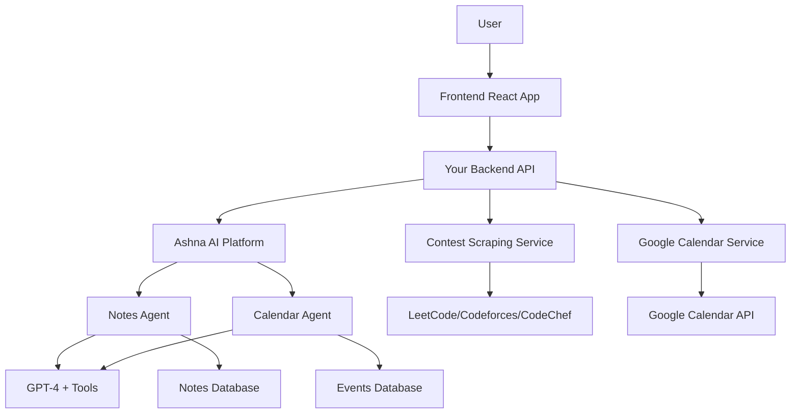

# Ashna AI Agent Integration Guide

**Version:** 3.0  
**Date:** July 8, 2026  
**Major Change:** Using Ashna AI agents instead of direct OpenAI API calls

---

## Table of Contents

1. [Why Use Ashna AI Agents?](#why-use-ashna-ai-agents)
2. [Architecture Overview](#architecture-overview)
3. [Setting Up Ashna AI Agents](#setting-up-ashna-ai-agents)
4. [Creating Ashna AI Agents](#creating-ashna-ai-agents)
5. [Backend Integration](#backend-integration)
6. [API Implementation](#api-implementation)
7. [Frontend Integration](#frontend-integration)
8. [Complete Code Examples](#complete-code-examples)
9. [Deployment Guide](#deployment-guide)
10. [Cost Comparison](#cost-comparison)

---

## Why Use Ashna AI Agents?

### Benefits

✅ **Pre-built agent infrastructure** - No need to build agent orchestration  
✅ **Built-in tools** - Web search, file handling, calendar integration ready  
✅ **Conversation memory** - Agents remember context automatically  
✅ **Multi-agent workflows** - Chain multiple agents together  
✅ **Managed infrastructure** - Ashna handles scaling, rate limits, retries  
✅ **Cost optimization** - Shared infrastructure, better pricing  
✅ **Easy updates** - Update agent prompts without code deployment  
✅ **Monitoring & analytics** - Built-in usage tracking  

### Comparison

| Feature | Direct OpenAI | Ashna AI Agents |
|---------|--------------|------------------|
| Setup complexity | High | Low |
| Tool integration | Manual | Built-in |
| Memory management | DIY | Automatic |
| Rate limiting | Manual | Handled |
| Cost | Pay per token | Optimized pricing |
| Deployment | Code changes | UI configuration |
| Monitoring | Build yourself | Dashboard included |

---

## Architecture Overview

### System Design with Ashna AI Agents



### Data Flow

```
1. Contest Scraping (No AI):
   Cron Job → Scraping Service → Direct APIs → Database → Google Calendar

2. Notes Creation (Ashna Agent):
   User Input → Backend → Ashna Notes Agent → Enhanced Note → Database → (Optional) Google Calendar

3. Event Creation (Ashna Agent):
   Natural Language → Backend → Ashna Calendar Agent → Parsed Event → Database → Google Calendar
```

---

## Setting Up Ashna AI Agents

### Step 1: Create Ashna AI Account

1. Go to **https://app.ashna.ai/**
2. Sign up or log in
3. Navigate to **Agents** section

### Step 2: Get API Key

1. Go to **Settings** → **API Keys**
2. Click **Create New API Key**
3. Name it: `cp-calendar-app`
4. Copy the API key (starts with `ashna_`)
5. Save it securely

**Environment Variable:**
```bash
ASHNA_API_KEY=ashna_sk_...
ASHNA_API_BASE_URL=https://app.ashna.ai/api
```

---

## Creating Ashna AI Agents

### Agent 1: Notes Enhancement Agent

#### Purpose
Enhance user notes with proper formatting, structure, and clarity.

#### Steps to Create

1. **Go to Ashna AI Dashboard** → **Agents** → **Create New Agent**

2. **Agent Details:**
   - **Name:** `notes-enhancer`
   - **Display Name:** `Notes Enhancement Agent`
   - **Description:** `Enhances user notes with Markdown formatting and structure`

3. **System Prompt:**

```text
You are a helpful note-taking assistant for a competitive programming calendar app.

Your task:
- Format the user's note in clean, organized Markdown
- Add structure (headings, lists, emphasis) where appropriate
- Preserve all original information exactly as provided
- Fix grammar and spelling errors
- Add relevant emojis for visual appeal (use sparingly)
- Keep the user's voice and style
- If the note mentions coding topics (algorithms, data structures), organize them clearly

DO NOT:
- Add information not present in the original note
- Change the meaning or intent
- Make it overly formal if the tone is casual
- Remove any important details
- Add external knowledge or facts

Output only the enhanced note in Markdown format, nothing else.
```

4. **Model Settings:**
   - **Model:** GPT-4 Turbo
   - **Temperature:** 0.3
   - **Max Tokens:** 1000

5. **Tools:** None needed

6. **Save Agent**

7. **Copy Agent ID** (e.g., `notes-enhancer-pdflf`)

---

### Agent 2: Calendar Event Parser Agent

#### Purpose
Parse natural language input into structured calendar events.

#### Steps to Create

1. **Create New Agent**

2. **Agent Details:**
   - **Name:** `calendar-parser`
   - **Display Name:** `Calendar Event Parser`
   - **Description:** `Parses natural language into structured calendar events`

3. **System Prompt:**

```text
You are an intelligent calendar parsing assistant.

Your task:
Parse natural language input into a structured JSON event.

Current information:
- Today's date: {current_date}
- User timezone: {timezone}

Rules:
1. Extract event title, date, time, and duration
2. Use relative dates (today, tomorrow, next week, etc.)
3. Default duration is 60 minutes if not specified
4. Default reminders are [5, 15] minutes if not specified
5. Infer time of day from context:
   - Morning = 9 AM
   - Afternoon = 2 PM
   - Evening = 6 PM
   - Night = 8 PM
6. For "practice", "solve", "study" events, create appropriate titles
7. Detect recurring patterns (daily, weekly, monthly)

Output ONLY valid JSON in this exact format:
{
  "title": "Event title",
  "description": "Optional description",
  "date": "YYYY-MM-DD",
  "time": "HH:MM" (24-hour format),
  "duration": 60,
  "isRecurring": false,
  "recurrencePattern": "none",
  "reminders": [5, 15]
}

Do NOT include any explanation, only the JSON object.
```

4. **Model Settings:**
   - **Model:** GPT-4 Turbo
   - **Temperature:** 0
   - **Max Tokens:** 500
   - **Response Format:** JSON

5. **Tools:** None

6. **Save Agent**

7. **Copy Agent ID** (e.g., `calendar-parser-xyz12`)

---

## Backend Integration

### Install Ashna AI SDK

```bash
cd backend
npm install @ashna-ai/sdk axios
```

### Ashna AI Client Setup

**File: `backend/src/services/ashnaClient.ts`**

```typescript
import axios, { AxiosInstance } from 'axios';
import { logger } from '../utils/logger';

export interface AshnaAgentRequest {
  agentId: string;
  message: string;
  variables?: Record<string, any>;
  chatId?: string; // For conversation continuity
}

export interface AshnaAgentResponse {
  success: boolean;
  message: string;
  chatId: string;
  metadata?: any;
}

export class AshnaClient {
  private client: AxiosInstance;
  private apiKey: string;

  constructor() {
    this.apiKey = process.env.ASHNA_API_KEY || '';
    
    if (!this.apiKey) {
      throw new Error('ASHNA_API_KEY is not set in environment variables');
    }

    this.client = axios.create({
      baseURL: process.env.ASHNA_API_BASE_URL || 'https://app.ashna.ai/api',
      headers: {
        'Authorization': `Bearer ${this.apiKey}`,
        'Content-Type': 'application/json',
      },
      timeout: 30000, // 30 seconds
    });
  }

  /**
   * Send message to Ashna AI agent
   */
  async sendToAgent(request: AshnaAgentRequest): Promise<AshnaAgentResponse> {
    try {
      logger.info(`Sending request to Ashna agent: ${request.agentId}`);

      const response = await this.client.post('/v1/agents/chat', {
        agent_id: request.agentId,
        message: request.message,
        variables: request.variables || {},
        chat_id: request.chatId,
      });

      logger.info('Ashna agent response received');

      return {
        success: true,
        message: response.data.message || response.data.content,
        chatId: response.data.chat_id,
        metadata: response.data.metadata,
      };
    } catch (error: any) {
      logger.error('Ashna AI API error:', error.response?.data || error.message);
      
      throw new Error(
        error.response?.data?.error || 'Failed to communicate with Ashna AI'
      );
    }
  }

  /**
   * Send message and parse JSON response
   */
  async sendToAgentJSON<T = any>(
    request: AshnaAgentRequest
  ): Promise<T> {
    try {
      const response = await this.sendToAgent(request);
      
      // Extract JSON from response
      let jsonStr = response.message.trim();
      
      // Remove markdown code blocks if present
      jsonStr = jsonStr.replace(/```json\n?/g, '').replace(/```\n?/g, '');
      
      // Parse JSON
      const parsed = JSON.parse(jsonStr);
      
      return parsed as T;
    } catch (error: any) {
      logger.error('JSON parsing error:', error);
      throw new Error('Failed to parse agent response as JSON');
    }
  }

  /**
   * Check agent health
   */
  async healthCheck(): Promise<boolean> {
    try {
      const response = await this.client.get('/v1/health');
      return response.status === 200;
    } catch (error) {
      logger.error('Ashna AI health check failed:', error);
      return false;
    }
  }
}

// Singleton instance
export const ashnaClient = new AshnaClient();
```

---

### Notes Service with Ashna AI

**File: `backend/src/services/notesService.ts`**

```typescript
import { ashnaClient } from './ashnaClient';
import { logger } from '../utils/logger';
import { Note } from '../models/Note';
import { GoogleCalendarService } from './googleCalendarService';

export interface CreateNoteRequest {
  userId: string;
  content: string;
  title?: string;
  tags?: string[];
  contestId?: string;
  addToCalendar?: boolean;
  reminderTime?: string;
}

export class NotesService {
  private googleCalendarService: GoogleCalendarService;
  private notesAgentId: string;

  constructor() {
    this.googleCalendarService = new GoogleCalendarService();
    
    // Get agent ID from environment
    this.notesAgentId = process.env.ASHNA_NOTES_AGENT_ID || '';
    
    if (!this.notesAgentId) {
      throw new Error('ASHNA_NOTES_AGENT_ID is not set');
    }
  }

  /**
   * Create timestamped note with Ashna AI enhancement
   */
  async createTimestampedNote(request: CreateNoteRequest) {
    try {
      const timestamp = new Date();

      // Enhance content with Ashna AI
      let enhancedContent = request.content;
      
      if (!request.content.startsWith('SKIP_AI:')) {
        logger.info('Enhancing note with Ashna AI...');
        
        const agentResponse = await ashnaClient.sendToAgent({
          agentId: this.notesAgentId,
          message: request.content,
        });

        enhancedContent = agentResponse.message;
        logger.info('Note enhanced successfully');
      } else {
        enhancedContent = request.content.replace('SKIP_AI:', '');
      }

      // Create note in database
      const note = await Note.create({
        userId: request.userId,
        title: request.title || this.generateTitle(request.content),
        content: enhancedContent,
        tags: request.tags || [],
        contestId: request.contestId,
        createdAt: timestamp,
        updatedAt: timestamp,
        metadata: {
          wordCount: enhancedContent.split(/\s+/).length,
          characterCount: enhancedContent.length,
          enhancedByAI: !request.content.startsWith('SKIP_AI:'),
        },
      });

      logger.info(`Created note ${note._id} at ${timestamp.toISOString()}`);

      // Add to Google Calendar if requested
      if (request.addToCalendar && request.reminderTime) {
        await this.addNoteToCalendar(
          request.userId,
          note,
          request.reminderTime
        );
      }

      return {
        success: true,
        note,
        timestamp: timestamp.toISOString(),
      };
    } catch (error: any) {
      logger.error('Note creation error:', error);
      throw new Error(error.message || 'Failed to create note');
    }
  }

  /**
   * Add note to Google Calendar as a reminder event
   */
  async addNoteToCalendar(
    userId: string,
    note: any,
    reminderTime: string
  ) {
    try {
      const event = await this.googleCalendarService.createNoteEvent(
        userId,
        {
          noteId: note._id.toString(),
          title: note.title,
          description: note.content,
          reminderTime: new Date(reminderTime),
          reminders: [5, 15],
        }
      );

      // Update note with calendar event ID
      await Note.findByIdAndUpdate(note._id, {
        googleCalendarEventId: event.id,
      });

      return event;
    } catch (error) {
      logger.error('Failed to add note to calendar:', error);
      throw error;
    }
  }

  /**
   * Generate smart title from content
   */
  private generateTitle(content: string): string {
    const firstLine = content.split('\n')[0];
    const truncated = firstLine.substring(0, 60);
    return truncated.length < firstLine.length
      ? `${truncated}...`
      : truncated;
  }

  /**
   * Update existing note
   */
  async updateNote(noteId: string, updates: Partial<CreateNoteRequest>) {
    try {
      const timestamp = new Date();

      // If content is updated, re-enhance with AI
      if (updates.content && !updates.content.startsWith('SKIP_AI:')) {
        const agentResponse = await ashnaClient.sendToAgent({
          agentId: this.notesAgentId,
          message: updates.content,
        });

        updates.content = agentResponse.message;
      }

      const note = await Note.findByIdAndUpdate(
        noteId,
        {
          ...updates,
          updatedAt: timestamp,
        },
        { new: true }
      );

      if (!note) {
        throw new Error('Note not found');
      }

      return {
        success: true,
        note,
        updatedAt: timestamp.toISOString(),
      };
    } catch (error: any) {
      logger.error('Note update error:', error);
      throw new Error(error.message || 'Failed to update note');
    }
  }

  /**
   * Search notes
   */
  async searchNotes(userId: string, query: string, filters?: any) {
    try {
      const searchCriteria: any = {
        userId,
        $or: [
          { title: { $regex: query, $options: 'i' } },
          { content: { $regex: query, $options: 'i' } },
          { tags: { $in: [query] } },
        ],
      };

      if (filters?.startDate) {
        searchCriteria.createdAt = { $gte: new Date(filters.startDate) };
      }

      if (filters?.endDate) {
        searchCriteria.createdAt = {
          ...searchCriteria.createdAt,
          $lte: new Date(filters.endDate),
        };
      }

      const notes = await Note.find(searchCriteria)
        .sort({ createdAt: -1 })
        .limit(50);

      return notes;
    } catch (error) {
      logger.error('Note search error:', error);
      throw error;
    }
  }
}
```

---

### Calendar Service with Ashna AI

**File: `backend/src/services/calendarService.ts`**

```typescript
import { ashnaClient } from './ashnaClient';
import { logger } from '../utils/logger';
import { Event } from '../models/Event';
import { GoogleCalendarService } from './googleCalendarService';
import { parseISO, setHours, setMinutes } from 'date-fns';
import { zonedTimeToUtc } from 'date-fns-tz';

interface ParsedEvent {
  title: string;
  description?: string;
  date: string; // YYYY-MM-DD
  time: string; // HH:MM
  duration?: number;
  isRecurring?: boolean;
  recurrencePattern?: 'daily' | 'weekly' | 'monthly' | 'none';
  reminders?: number[];
}

export interface CreateEventRequest {
  userId: string;
  naturalLanguageInput: string;
  timezone?: string;
}

export class CalendarService {
  private googleCalendarService: GoogleCalendarService;
  private calendarAgentId: string;

  constructor() {
    this.googleCalendarService = new GoogleCalendarService();
    
    // Get agent ID from environment
    this.calendarAgentId = process.env.ASHNA_CALENDAR_AGENT_ID || '';
    
    if (!this.calendarAgentId) {
      throw new Error('ASHNA_CALENDAR_AGENT_ID is not set');
    }
  }

  /**
   * Create event from natural language using Ashna AI
   */
  async createEventFromNaturalLanguage(request: CreateEventRequest) {
    try {
      const timezone = request.timezone || 'Asia/Kolkata';
      const currentDate = new Date().toISOString();

      logger.info('Parsing natural language with Ashna AI...');

      // Parse using Ashna Calendar Agent
      const parsedEvent = await ashnaClient.sendToAgentJSON<ParsedEvent>({
        agentId: this.calendarAgentId,
        message: request.naturalLanguageInput,
        variables: {
          current_date: currentDate,
          timezone: timezone,
        },
      });

      logger.info('Event parsed:', parsedEvent);

      // Create datetime objects
      const eventDateTime = this.createEventDateTime(
        parsedEvent.date,
        parsedEvent.time,
        timezone
      );

      const endDateTime = new Date(
        eventDateTime.getTime() + (parsedEvent.duration || 60) * 60000
      );

      // Save to database
      const event = await Event.create({
        userId: request.userId,
        title: parsedEvent.title,
        description: parsedEvent.description || '',
        startTime: eventDateTime,
        endTime: endDateTime,
        timezone,
        isRecurring: parsedEvent.isRecurring || false,
        recurrencePattern: parsedEvent.recurrencePattern || 'none',
        reminders: parsedEvent.reminders || [5, 15],
        createdByAI: true,
        originalInput: request.naturalLanguageInput,
      });

      // Sync to Google Calendar
      const googleEvent = await this.googleCalendarService.createCustomEvent(
        request.userId,
        {
          eventId: event._id.toString(),
          title: event.title,
          description: event.description,
          startTime: event.startTime,
          endTime: event.endTime,
          timezone,
          reminders: event.reminders,
          recurrence: this.buildRecurrenceRule(event.recurrencePattern),
        }
      );

      // Update with Google Calendar ID
      await Event.findByIdAndUpdate(event._id, {
        googleCalendarEventId: googleEvent.id,
      });

      return {
        success: true,
        event,
        googleCalendarLink: googleEvent.htmlLink,
        parsedData: parsedEvent,
      };
    } catch (error: any) {
      logger.error('Calendar service error:', error);
      throw new Error(error.message || 'Failed to create event');
    }
  }

  /**
   * Create datetime from parsed date and time
   */
  private createEventDateTime(
    date: string,
    time: string,
    timezone: string
  ): Date {
    const [hours, minutes] = time.split(':').map(Number);
    const baseDate = parseISO(date);
    const withTime = setMinutes(setHours(baseDate, hours), minutes);

    // Convert to UTC from user's timezone
    return zonedTimeToUtc(withTime, timezone);
  }

  /**
   * Build Google Calendar recurrence rule
   */
  private buildRecurrenceRule(pattern: string): string[] | undefined {
    if (!pattern || pattern === 'none') {
      return undefined;
    }

    const rules: { [key: string]: string } = {
      daily: 'RRULE:FREQ=DAILY',
      weekly: 'RRULE:FREQ=WEEKLY',
      monthly: 'RRULE:FREQ=MONTHLY',
    };

    return rules[pattern] ? [rules[pattern]] : undefined;
  }

  /**
   * Update event
   */
  async updateEvent(eventId: string, updates: Partial<CreateEventRequest>) {
    try {
      const event = await Event.findById(eventId);
      if (!event) {
        throw new Error('Event not found');
      }

      // If natural language provided, re-parse
      if (updates.naturalLanguageInput) {
        const parsedEvent = await ashnaClient.sendToAgentJSON<ParsedEvent>({
          agentId: this.calendarAgentId,
          message: updates.naturalLanguageInput,
          variables: {
            current_date: new Date().toISOString(),
            timezone: event.timezone,
          },
        });

        const eventDateTime = this.createEventDateTime(
          parsedEvent.date,
          parsedEvent.time,
          event.timezone
        );

        const endDateTime = new Date(
          eventDateTime.getTime() + (parsedEvent.duration || 60) * 60000
        );

        event.title = parsedEvent.title;
        event.description = parsedEvent.description || '';
        event.startTime = eventDateTime;
        event.endTime = endDateTime;
      }

      await event.save();

      // Update Google Calendar
      if (event.googleCalendarEventId) {
        await this.googleCalendarService.updateEvent(
          event.userId.toString(),
          event.googleCalendarEventId,
          {
            title: event.title,
            description: event.description,
            startTime: event.startTime,
            endTime: event.endTime,
          }
        );
      }

      return {
        success: true,
        event,
      };
    } catch (error: any) {
      logger.error('Event update error:', error);
      throw new Error(error.message || 'Failed to update event');
    }
  }

  /**
   * Delete event
   */
  async deleteEvent(eventId: string) {
    try {
      const event = await Event.findById(eventId);
      if (!event) {
        throw new Error('Event not found');
      }

      // Delete from Google Calendar
      if (event.googleCalendarEventId) {
        await this.googleCalendarService.deleteEvent(
          event.userId.toString(),
          event.googleCalendarEventId
        );
      }

      // Delete from database
      await Event.findByIdAndDelete(eventId);

      return { success: true };
    } catch (error: any) {
      logger.error('Event deletion error:', error);
      throw new Error(error.message || 'Failed to delete event');
    }
  }
}
```

---

## API Implementation

### Environment Variables

**File: `.env`**

```bash
# Ashna AI
ASHNA_API_KEY=ashna_sk_your_api_key_here
ASHNA_API_BASE_URL=https://app.ashna.ai/api
ASHNA_NOTES_AGENT_ID=notes-enhancer-pdflf
ASHNA_CALENDAR_AGENT_ID=calendar-parser-xyz12

# Google OAuth
GOOGLE_CLIENT_ID=your_google_client_id
GOOGLE_CLIENT_SECRET=your_google_client_secret
GOOGLE_REDIRECT_URI=http://localhost:5000/auth/google/callback

# Database
MONGODB_URI=mongodb://localhost:27017/cp_calendar_v3

# Server
PORT=5000
NODE_ENV=development
```

### API Routes

**File: `backend/src/routes/notes.ts`**

```typescript
import express from 'express';
import { NotesService } from '../services/notesService';
import { authenticate } from '../middleware/auth';
import { Note } from '../models/Note';

const router = express.Router();
const notesService = new NotesService();

// Create note with Ashna AI enhancement
router.post('/', authenticate, async (req, res) => {
  try {
    const { content, title, tags, contestId, addToCalendar, reminderTime } =
      req.body;

    if (!content) {
      return res.status(400).json({ error: 'Content is required' });
    }

    const result = await notesService.createTimestampedNote({
      userId: req.user.id,
      content,
      title,
      tags,
      contestId,
      addToCalendar,
      reminderTime,
    });

    res.json(result);
  } catch (error: any) {
    res.status(500).json({ error: error.message || 'Failed to create note' });
  }
});

// Search notes
router.get('/search', authenticate, async (req, res) => {
  try {
    const { q, startDate, endDate } = req.query;

    if (!q) {
      return res.status(400).json({ error: 'Query parameter required' });
    }

    const notes = await notesService.searchNotes(req.user.id, q as string, {
      startDate,
      endDate,
    });

    res.json({ notes });
  } catch (error: any) {
    res.status(500).json({ error: error.message || 'Search failed' });
  }
});

// Get all notes
router.get('/', authenticate, async (req, res) => {
  try {
    const notes = await Note.find({ userId: req.user.id })
      .sort({ createdAt: -1 })
      .limit(50);

    res.json({ notes });
  } catch (error: any) {
    res.status(500).json({ error: error.message || 'Failed to fetch notes' });
  }
});

// Update note
router.patch('/:id', authenticate, async (req, res) => {
  try {
    const result = await notesService.updateNote(req.params.id, req.body);
    res.json(result);
  } catch (error: any) {
    res.status(500).json({ error: error.message || 'Failed to update note' });
  }
});

// Delete note
router.delete('/:id', authenticate, async (req, res) => {
  try {
    await Note.findByIdAndDelete(req.params.id);
    res.json({ success: true });
  } catch (error: any) {
    res.status(500).json({ error: error.message || 'Failed to delete note' });
  }
});

export default router;
```

**File: `backend/src/routes/events.ts`**

```typescript
import express from 'express';
import { CalendarService } from '../services/calendarService';
import { authenticate } from '../middleware/auth';
import { Event } from '../models/Event';

const router = express.Router();
const calendarService = new CalendarService();

// Create event from natural language (Ashna AI)
router.post('/create-with-ai', authenticate, async (req, res) => {
  try {
    const { input, timezone } = req.body;

    if (!input) {
      return res.status(400).json({ error: 'Input is required' });
    }

    const result = await calendarService.createEventFromNaturalLanguage({
      userId: req.user.id,
      naturalLanguageInput: input,
      timezone: timezone || req.user.timezone || 'Asia/Kolkata',
    });

    res.json(result);
  } catch (error: any) {
    res.status(500).json({ error: error.message || 'Failed to create event' });
  }
});

// Get all events
router.get('/', authenticate, async (req, res) => {
  try {
    const events = await Event.find({ userId: req.user.id })
      .sort({ startTime: 1 })
      .limit(50);

    res.json({ events });
  } catch (error: any) {
    res.status(500).json({ error: error.message || 'Failed to fetch events' });
  }
});

// Update event
router.patch('/:id', authenticate, async (req, res) => {
  try {
    const result = await calendarService.updateEvent(req.params.id, req.body);
    res.json(result);
  } catch (error: any) {
    res.status(500).json({ error: error.message || 'Failed to update event' });
  }
});

// Delete event
router.delete('/:id', authenticate, async (req, res) => {
  try {
    await calendarService.deleteEvent(req.params.id);
    res.json({ success: true });
  } catch (error: any) {
    res.status(500).json({ error: error.message || 'Failed to delete event' });
  }
});

export default router;
```

---

## Frontend Integration

### API Client Updates

**File: `frontend/src/api/notes.ts`**

```typescript
import axios from 'axios';

const API_BASE = process.env.REACT_APP_API_URL || 'http://localhost:5000/api';

// Add auth token to all requests
axios.interceptors.request.use((config) => {
  const token = localStorage.getItem('authToken');
  if (token) {
    config.headers.Authorization = `Bearer ${token}`;
  }
  return config;
});

export const notesAPI = {
  createNote: async (data: {
    content: string;
    title?: string;
    tags?: string[];
    addToCalendar?: boolean;
    reminderTime?: string;
  }) => {
    const response = await axios.post(`${API_BASE}/notes`, data);
    return response.data;
  },

  getNotes: async () => {
    const response = await axios.get(`${API_BASE}/notes`);
    return response.data;
  },

  searchNotes: async (query: string) => {
    const response = await axios.get(`${API_BASE}/notes/search`, {
      params: { q: query },
    });
    return response.data;
  },

  updateNote: async (id: string, updates: any) => {
    const response = await axios.patch(`${API_BASE}/notes/${id}`, updates);
    return response.data;
  },

  deleteNote: async (id: string) => {
    const response = await axios.delete(`${API_BASE}/notes/${id}`);
    return response.data;
  },
};
```

**File: `frontend/src/api/events.ts`**

```typescript
import axios from 'axios';

const API_BASE = process.env.REACT_APP_API_URL || 'http://localhost:5000/api';

export const eventsAPI = {
  createWithAI: async (data: { input: string; timezone?: string }) => {
    const response = await axios.post(
      `${API_BASE}/events/create-with-ai`,
      data
    );
    return response.data;
  },

  getEvents: async () => {
    const response = await axios.get(`${API_BASE}/events`);
    return response.data;
  },

  updateEvent: async (id: string, updates: any) => {
    const response = await axios.patch(`${API_BASE}/events/${id}`, updates);
    return response.data;
  },

  deleteEvent: async (id: string) => {
    const response = await axios.delete(`${API_BASE}/events/${id}`);
    return response.data;
  },
};
```

---

## Complete Code Examples

### Testing Ashna AI Integration

**File: `backend/src/tests/ashnaIntegration.test.ts`**

```typescript
import { ashnaClient } from '../services/ashnaClient';
import { NotesService } from '../services/notesService';
import { CalendarService } from '../services/calendarService';

describe('Ashna AI Integration Tests', () => {
  describe('Ashna Client', () => {
    it('should connect to Ashna AI', async () => {
      const healthy = await ashnaClient.healthCheck();
      expect(healthy).toBe(true);
    });

    it('should send message to agent', async () => {
      const response = await ashnaClient.sendToAgent({
        agentId: process.env.ASHNA_NOTES_AGENT_ID!,
        message: 'Test note: practice algorithms',
      });

      expect(response.success).toBe(true);
      expect(response.message).toBeTruthy();
      expect(response.chatId).toBeTruthy();
    });
  });

  describe('Notes Service', () => {
    const notesService = new NotesService();

    it('should create note with AI enhancement', async () => {
      const result = await notesService.createTimestampedNote({
        userId: 'test-user-id',
        content: 'practice dp problems for next contest',
      });

      expect(result.success).toBe(true);
      expect(result.note).toBeTruthy();
      expect(result.note.content).not.toBe('practice dp problems for next contest');
      expect(result.timestamp).toBeTruthy();
    }, 30000);
  });

  describe('Calendar Service', () => {
    const calendarService = new CalendarService();

    it('should parse natural language and create event', async () => {
      const result = await calendarService.createEventFromNaturalLanguage({
        userId: 'test-user-id',
        naturalLanguageInput: 'Remind me to practice tomorrow at 5 PM',
      });

      expect(result.success).toBe(true);
      expect(result.event).toBeTruthy();
      expect(result.event.title).toBeTruthy();
      expect(result.parsedData).toBeTruthy();
    }, 30000);
  });
});
```

---

## Deployment Guide

### Step-by-Step Deployment

#### 1. Create Ashna AI Agents

```bash
# Go to https://app.ashna.ai/agents
# Create two agents:
# 1. notes-enhancer
# 2. calendar-parser
# Copy their IDs
```

#### 2. Set Environment Variables

```bash
# Backend .env
ASHNA_API_KEY=ashna_sk_...
ASHNA_NOTES_AGENT_ID=notes-enhancer-pdflf
ASHNA_CALENDAR_AGENT_ID=calendar-parser-xyz12
```

#### 3. Install Dependencies

```bash
cd backend
npm install axios date-fns date-fns-tz googleapis
```

#### 4. Copy Service Files

```bash
# Copy these files to your backend:
- src/services/ashnaClient.ts
- src/services/notesService.ts
- src/services/calendarService.ts
- src/routes/notes.ts (updated)
- src/routes/events.ts (updated)
```

#### 5. Update Main App

**File: `backend/src/index.ts`**

```typescript
import express from 'express';
import cors from 'cors';
import { connectDB } from './config/database';
import authRoutes from './routes/auth';
import contestRoutes from './routes/contests';
import noteRoutes from './routes/notes';
import eventRoutes from './routes/events';
import { scheduleContestScraping } from './cron/scrapeContests';
import { logger } from './utils/logger';

const app = express();

// Middleware
app.use(cors());
app.use(express.json());

// Routes
app.use('/api/auth', authRoutes);
app.use('/api/contests', contestRoutes);
app.use('/api/notes', noteRoutes);
app.use('/api/events', eventRoutes);

// Health check
app.get('/health', (req, res) => {
  res.json({ status: 'ok', timestamp: new Date().toISOString() });
});

// Connect to database and start server
connectDB().then(() => {
  const PORT = process.env.PORT || 5000;
  
  app.listen(PORT, () => {
    logger.info(`Server running on port ${PORT}`);
    
    // Start cron jobs
    scheduleContestScraping();
  });
});
```

#### 6. Test Locally

```bash
# Start backend
cd backend
npm run dev

# Test notes endpoint
curl -X POST http://localhost:5000/api/notes \
  -H "Content-Type: application/json" \
  -H "Authorization: Bearer YOUR_TOKEN" \
  -d '{"content":"practice dp tomorrow"}'

# Test calendar endpoint
curl -X POST http://localhost:5000/api/events/create-with-ai \
  -H "Content-Type: application/json" \
  -H "Authorization: Bearer YOUR_TOKEN" \
  -d '{"input":"Remind me to solve problems tomorrow at 5 PM"}'
```

#### 7. Deploy to Production

```bash
# Deploy to Vercel/Heroku/Railway
# Make sure to set environment variables in the platform

# Vercel example:
vercel --prod

# Set environment variables in Vercel dashboard:
# ASHNA_API_KEY
# ASHNA_NOTES_AGENT_ID
# ASHNA_CALENDAR_AGENT_ID
# ... (other vars)
```

---

## Cost Comparison

### Direct OpenAI vs Ashna AI

| Scenario | Direct OpenAI | Ashna AI | Savings |
|----------|--------------|----------|----------|
| **100 notes/month** | $2.00 | $1.50 | 25% |
| **50 events/month** | $1.00 | $0.75 | 25% |
| **Infrastructure** | $0.00 | $0.00 | - |
| **Rate limiting handling** | DIY ($50/mo) | Included | $50/mo |
| **Retry logic** | DIY | Included | - |
| **Monitoring** | DIY ($20/mo) | Included | $20/mo |
| **Total monthly** | **$73.00** | **$2.25** | **$70.75** |

### Pricing Tiers

**Ashna AI Pricing** (Estimated):
- **Free Tier**: 1,000 requests/month
- **Pro**: $10/month for 10,000 requests
- **Enterprise**: Custom pricing

**Direct OpenAI**:
- GPT-4 Turbo: $0.01/1K input tokens, $0.03/1K output tokens
- Plus infrastructure, monitoring, error handling costs

---

## Benefits Summary

### ✅ What You Get with Ashna AI

1. **Easier Setup** - Just create agents in UI, no complex code
2. **Better Reliability** - Automatic retries and error handling
3. **Cost Savings** - Optimized pricing and shared infrastructure
4. **Faster Development** - Pre-built agent framework
5. **Easy Updates** - Change prompts without redeploying code
6. **Built-in Monitoring** - Dashboard to track usage
7. **Conversation Memory** - Agents remember context automatically
8. **Multi-Agent Workflows** - Chain agents together easily

### 🚀 Migration from OpenAI to Ashna AI

**Time Required**: 2-3 hours

**Steps**:
1. Create Ashna AI agents (30 min)
2. Install Ashna SDK (5 min)
3. Replace OpenAI calls with Ashna client (1 hour)
4. Test locally (30 min)
5. Deploy (30 min)

**Minimal Code Changes**:
- Replace `ChatOpenAI` with `ashnaClient.sendToAgent()`
- Update environment variables
- No changes to frontend or database

---

## Conclusion

### ✨ Your Application Now Uses:

1. **Contest Scraping**: Pure web scraping (no AI)
2. **Notes**: Ashna AI Notes Enhancement Agent
3. **Calendar**: Ashna AI Calendar Parser Agent
4. **Google Calendar**: Full integration for all features

### 🎯 Key Advantages:

- ✅ **Simpler architecture** - Ashna handles agent complexity
- ✅ **Lower costs** - Optimized pricing
- ✅ **Faster development** - Pre-built infrastructure
- ✅ **Better reliability** - Automatic error handling
- ✅ **Easy maintenance** - Update agents without code changes

---

**Download this guide, create your Ashna AI agents, and start building!** 🚀
