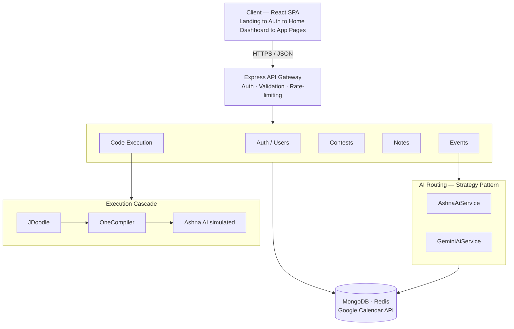

<div align="center">


# 📅 CP Calendar Pro <sub><i>(CalNote)</i></sub>

### A Next-Generation AI-Powered Scheduling, Notes & Code Execution Assistant<br/>for Competitive Programmers

<p>
  <a href="https://calnote.pages.dev/"><b>🌐 Live Frontend</b></a>
  &nbsp;•&nbsp;
  <a href="https://calnote.onrender.com"><b>⚙️ Live Backend</b></a>
  &nbsp;•&nbsp;
  <a href="#-getting-started"><b>🚀 Quick Start</b></a>
  &nbsp;•&nbsp;
  <a href="#-key-features"><b>✨ Features</b></a>
</p>

<br/>

<!-- Status Badges -->


<br/><br/>

<!-- Tech Badges -->


</div>

<br/>

> [!WARNING]
> The backend runs on **Render's free tier**, which spins down after 15 minutes of inactivity. The **first** request after a period of idle may take 30–60 seconds to wake the server — subsequent requests are fast. This is an accepted tradeoff of free hosting, not a bug.

<br/>

## 📖 Overview

**CP Calendar Pro** is a full-stack scheduling application purpose-built for competitive programmers and busy developers. It aggregates upcoming programming contests from major platforms (Codeforces, LeetCode, CodeChef, AtCoder) and layers a **context-aware AI scheduling agent** on top of a traditional calendar, notes, and in-app code execution system.

Instead of just creating isolated events, the AI reasons over your existing calendar, upcoming contests, and personal preferences (sleep window, timezone) to propose or directly create optimal calendar blocks — routing sleep and study time around contests automatically.

At its core is a **pluggable dual-provider AI engine**: **Ashna AI** (a managed, OpenAI-compatible AI platform) and a **Custom AI Agent** (powered by Google's Gemini API) are both routed through a shared Strategy Pattern, so the rest of the app never needs to know which one produced a given event. The active provider is configured once in **Settings**.

The frontend is a fully installable **Progressive Web App** — add it to your home screen or desktop for a native-app-like experience, with fast repeat loads and resilient offline messaging (see [Progressive Web App](#-progressive-web-app) for exactly what is and isn't available offline).

<br/>

<div align="center">

## 📑 Table of Contents

</div>

<table>
<tr>
<td valign="top" width="33%">

**Get Started**
- [✨ Key Features](#-key-features)
- [🛠️ Tech Stack](#️-tech-stack)
- [🚀 Getting Started](#-getting-started)
- [🔑 Environment Variables](#-environment-variables)

</td>
<td valign="top" width="33%">

**Dig Deeper**
- [🏗️ Architecture](#️-architecture-overview)
- [🧠 AI Strategy Engine](#-the-ai-strategy-engine)
- [📱 Progressive Web App](#-progressive-web-app)
- [📂 Project Structure](#-project-structure)
- [📡 API Reference](#-api-overview)

</td>
<td valign="top" width="33%">

**Operate & Contribute**
- [🐳 Docker](#-running-with-docker)
- [☁️ Deployment](#️-deployment)
- [🧪 Testing](#-testing)
- [🗺️ Roadmap](#️-known-gaps--roadmap)
- [🤝 Contributing](#-contributing)

</td>
</tr>
</table>

<br/>

## ✨ Key Features

<table>
<tr>
<td width="50%" valign="top">

### 🧠 AI-Powered Scheduling
Chat with your calendar in plain language. The AI reasons over your existing events, upcoming contests, and sleep window to schedule (or reschedule) blocks — no manual conflict-checking needed.

### 🎙️ Voice Input
Speak your scheduling requests via the browser's native Web Speech API. The AI is told the input came from voice and interprets filler words and transcription artifacts charitably.

### 🔄 Pluggable AI Architecture
A Strategy Pattern makes **Ashna AI** and a **Gemini-backed Custom Agent** fully interchangeable — configured once in Settings, both follow identical scheduling rules.

### 🏆 Automated Contest Aggregation
A scheduled job scrapes **Codeforces, LeetCode, CodeChef, and AtCoder** every 30 minutes and auto-purges contests that ended 7+ days ago.

### 📝 Intentional Rich-Text Notes
Built on Tiptap — notes are *never* auto-created from AI events. Pick a specific event from a searchable picker to write about it, or write standalone.

### ✨ Highlight-to-Ask-AI
Select any code or text inside a note to get a floating Ashna AI panel — Explain, Review for Errors, Optimise, or ask a custom question.

</td>
<td width="50%" valign="top">

### 💻 In-App Code Execution
A 3-tier fallback cascade (**JDoodle → OneCompiler → AI-simulated last resort**) runs code with a dedicated stdin field, independent of any single provider's uptime.

### 🔐 Google Sign-In & Calendar Sync
Two distinct flows: sign in with Google directly, or separately link Google Calendar from Settings to push events and preview your real calendar.

### 🏠 Landing Page + Home Dashboard
Logged-out visitors see a marketing landing page; logged-in users land on a dashboard summarizing the week, recent notes, and quick-launch cards.

### 📌 Sidebar Event Details
Clicking a calendar event shows details — including AI reasoning — in the sidebar instead of an interrupting modal.

### 🌗 Light/Dark Mode + Header Clock
A cohesive, professional theme in both modes, plus a live IST clock with a 12h/24h toggle.

### 📲 Installable PWA
Add to your home screen on desktop, Android, or iOS for a native-app-like experience — fast repeat loads via a precached app shell, and honest offline messaging for the features that genuinely can't work without a connection.

### 🔒 Secure, Race-Free Auth
JWT with rotating refresh tokens, reuse-detection, and atomic (race-condition-free) preference and session updates.

</td>
</tr>
</table>

<br/>

## 🛠️ Tech Stack

<div align="center">

| Layer | Technologies |
|:---|:---|
| **Frontend** |    TanStack Query · Zustand · React Router v6 |
| **PWA** | `vite-plugin-pwa` (Workbox) — precached app shell, route-classified runtime caching, installable manifest, update/install prompts |
| **Calendar / Editor** | react-big-calendar · Monaco Editor · Tiptap (rich text) |
| **Voice** | Web Speech API (browser-native, zero external service) |
| **Backend** |   TypeScript (strict) |
| **Database** |  via Mongoose |
| **Cache / Queue** |  (`ioredis` + `redis`) · BullMQ · Agenda.js |
| **Auth** | JWT (access + rotating refresh) · `bcryptjs` · Google Identity Services |
| **AI Providers** | Ashna AI (OpenAI-compatible) · Google Gemini (`@google/genai`) |
| **Code Execution** | JDoodle → OneCompiler → Ashna AI (simulated fallback) |
| **External APIs** | Google Calendar · Codeforces · LeetCode GraphQL · CodeChef |
| **Validation** | Zod |
| **Testing** | Vitest · Supertest · mongodb-memory-server |
| **Deployment** |   MongoDB Atlas · Upstash Redis · Docker |

</div>

<br/>

## 🏗️ Architecture Overview

CP Calendar Pro follows a **layered, service-oriented monolith**: a single deployable Express backend, internally organized into strict module boundaries (Auth, Users, Events, Contests, Notes, AI, Code Execution), each exposing a `*.controller.ts` / `*.service.ts` / `*.routes.ts` split — enough separation to extract into standalone services later, without premature microservices overhead today.



All timestamps are stored in MongoDB as **UTC** and converted to **IST (`Asia/Kolkata`)** exclusively at the API boundary — see [Timezone Handling](#-timezone-handling-ist).

<br/>

## 🧠 The AI Strategy Engine

The defining architectural feature of this app is a strict **Strategy Pattern** for AI scheduling, ensuring Ashna AI and the Custom AI (Gemini) Agent are fully interchangeable from the consumer's point of view.

```typescript
interface AiProvider {
  readonly providerId: 'ashna' | 'custom';
  generateSchedule(context: SchedulingContext): Promise<NormalizedAiEventResponse>;
}
```

- 🏭 `AiProviderFactory.resolve(providerFlag)` is the **single place** in the codebase that maps a provider flag to a concrete implementation — no controller, queue worker, or frontend component ever imports `AshnaAiService` or `GeminiAiService` directly.
- 🛡️ Gemini output is forced through **three layers** of normalization: `responseMimeType: "application/json"` + `responseSchema` API-level constraints, followed by an independent Zod validation pass — catching cases like `endTime` before `startTime` that schema constraints alone can't enforce.
- ⚠️ Ashna AI has **no documented API-level JSON-mode parameter** — its output relies entirely on system-prompt instruction plus that same shared Zod validation layer, the sole safety net for that provider.
- 🤝 Both providers share **one system-instruction contract** (sleep-window avoidance, contest-conflict avoidance, IST-qualified timestamps, human-readable reasoning, voice-input tolerance) — switching providers changes *who* executes the rules, never *what* the rules are.
- ⏱️ Requests exceeding a ~20s synchronous threshold transparently fall back to a **BullMQ-backed async job**, polled via `GET /ai/schedule/status/:jobId`.

<br/>

## 📱 Progressive Web App

CP Calendar Pro is a fully installable PWA — desktop, Android, and iOS all supported, each with the appropriate install flow for that platform.

<table>
<tr><td>

- 🚀 **Precached app shell** — JS/CSS/HTML bundles are cached at build time (Workbox `CacheFirst`), so repeat loads are fast and largely network-independent.
- 🎯 **Route-classified runtime caching**, deliberately *not* a blanket cache-everything strategy:

  | Data | Strategy | Why |
  |:---|:---|:---|
  | `/ai/*`, `/code-execution/*`, `/auth/*` | **Network-only** | Live AI generation, code execution, and auth have no honest cached equivalent — serving stale output as current would be misleading |
  | `/events`, `/notes`, `/users/me/preferences` | **Network-first**, 8s timeout, short cache fallback | Survives Render's cold-start wake window without a blank screen, while always preferring live data |
  | `/contests` | **Stale-while-revalidate** | Server-side data only changes every 30 min anyway — instant from cache, quietly refreshed |
  | Static assets, logo, icons | **Cache-first**, 30-day TTL | Rarely changes, safe to cache aggressively |

- 🔔 **Explicit update prompts, never silent swaps** — a new deployed version waits for the user to click "Refresh Now," so mid-edit form state (e.g., Settings) is never discarded out from under them.
- 📥 **Native install prompts** on Chrome/Edge/Android; automatic **manual "Add to Home Screen" instructions** on iOS Safari, where the standard install API doesn't exist at all.
- 🍎 **iOS-specific handling** — status bar theming, safe-area-inset padding for the notch/Dynamic Island, and Safari's lack of `beforeinstallprompt` are all accounted for, not assumed away.
- 🔒 **Per-user cache clearing on logout** — the runtime cache of events/notes/preferences is explicitly cleared when a user logs out, closing a low-probability but real window where a shared browser could otherwise serve one user's cached data to the next.

</td></tr>
</table>

> [!IMPORTANT]
> **What a PWA honestly delivers here, and what it deliberately doesn't:** installability and fast repeat loads, yes. Offline AI scheduling, offline code execution, or offline contest scraping — no. These are live, third-party-API-dependent features with no meaningful offline equivalent, and the app is explicit about that: an `OfflineBanner` tells users plainly that AI scheduling and code execution need a connection, rather than letting those features fail silently or confusingly while offline.

<br/>

## 📂 Project Structure

<details>
<summary><b>Click to expand full directory tree</b></summary>

```text
cp-calendar-pro/
├── backend/                     # Express.js + TypeScript API
│   ├── src/
│   │   ├── config/              # DB, Redis, Google OAuth, env validation
│   │   ├── models/               # Mongoose schemas (User, Event, Contest, Note)
│   │   ├── middleware/           # auth, validation, rate limiting, error handling
│   │   ├── modules/
│   │   │   ├── auth/             # JWT rotation, Google Sign-In, Calendar OAuth
│   │   │   ├── users/            # preferences, sleep window, sessions
│   │   │   ├── events/           # CRUD, conflicts, RRULE recurrence, GCal push/pull
│   │   │   ├── contests/         # per-platform scrapers + cron + stale-contest purge
│   │   │   ├── notes/            # rich-text notes CRUD, event-linked
│   │   │   ├── codeExecution/    # provider cascade (JDoodle, OneCompiler, Ashna)
│   │   │   └── ai/               # Strategy Pattern: interface, factory, providers
│   │   └── utils/                # timezone, encryption, logging, error types
│   ├── tests/                    # unit · integration · e2e
│   ├── Dockerfile
│   └── package.json
│
├── frontend/                    # React + Vite SPA
│   ├── src/
│   │   ├── app/                  # router, query client, app root
│   │   ├── stores/                # Zustand: auth, AI provider, theme, UI state
│   │   ├── api/                   # typed Axios wrappers per domain
│   │   ├── queries/                # TanStack Query hooks
│   │   ├── components/
│   │   │   ├── ai/                 # chat panel (voice input), reasoning tooltip
│   │   │   ├── calendar/            # grid, sidebar event details, GCal preview
│   │   │   ├── code/                # Monaco-based code execution panel
│   │   │   ├── contests/             # list, card, platform filter
│   │   │   ├── notes/                 # editor, event picker, highlight-to-ask-AI
│   │   │   ├── settings/               # account, AI prefs, scheduling, security
│   │   │   ├── layout/                  # app shell, nav rail
│   │   │   └── common/                   # error boundary, spinner, logo, toggles,
│   │   │                                 # PWA install/update prompts, offline banner
│   │   └── pages/                # landing, auth, home, calendar, notes, code…
│   ├── public/
│   │   └── assets/               # logo, generated PWA icons (192/512/maskable)
│   ├── Dockerfile
│   └── package.json
│
├── Documentation/               # Detailed HLD, ERD, data flows, and SRS
└── docker-compose.yml           # Orchestrates MongoDB, Redis, Frontend, Backend
```

</details>

<br/>

## 🚀 Getting Started

### Prerequisites

- ✅ [Node.js](https://nodejs.org/) ≥ 20
- ✅ [Docker](https://www.docker.com/) + Docker Compose *(recommended)*, or local MongoDB + Redis
- ✅ A [Gemini API key](https://aistudio.google.com)
- ✅ An **Ashna AI** API key + two agent/model IDs (calendar scheduling, notes/code Q&A)
- ✅ Google OAuth credentials (shared by Google Sign-In and Calendar sync)
- ⚙️ *Optional* — [JDoodle](https://www.jdoodle.com/compiler-api) and/or [OneCompiler](https://onecompiler.com/api) keys for real code execution (falls back to AI-simulated output otherwise)

### ⚡ Run with Docker (Recommended)

```bash
git clone <your-repo-url>
cd CalNote

docker-compose up --build
```

| Service | URL |
|:---|:---|
| 🖥️ Frontend | `http://localhost:5173` |
| ⚙️ Backend API | `http://localhost:4000` |

### 🔧 Run Locally (Development Mode)

```bash
# 1. Backend
cd backend
npm install
cp .env.example .env   # fill in the values — see below
npm run dev             # → http://localhost:4000

# 2. Frontend (in a second terminal)
cd frontend
npm install
cp .env.example .env
npm run dev             # → http://localhost:5173
```

The backend automatically connects to MongoDB/Redis, starts the contest-scraping cron (once immediately, then every 30 minutes), and boots the AI job queue worker on launch.

<br/>

## 🔑 Environment Variables

<details>
<summary><b>Backend (<code>backend/.env</code>)</b></summary>

| Variable | Description |
|---|---|
| `MONGO_URI` | MongoDB connection string |
| `REDIS_URL`, `REDIS_HOST`, `REDIS_PORT` | Redis connection — `REDIS_URL` for the `redis` client (caching/OAuth state); `REDIS_HOST`/`REDIS_PORT` construct the `ioredis` client BullMQ requires |
| `JWT_ACCESS_SECRET`, `JWT_REFRESH_SECRET` | Long random strings, ≥32 chars |
| `FIELD_ENCRYPTION_KEY` | 64-char hex string (32 bytes) — encrypts user-supplied Gemini API keys at rest |
| `GOOGLE_CLIENT_ID`, `GOOGLE_CLIENT_SECRET`, `GOOGLE_REDIRECT_URI` | Google OAuth app credentials, shared by Sign-In and Calendar linking |
| `GEMINI_API_KEY` | Platform-level Gemini key (users may supply their own via Settings) |
| `ASHNA_API_KEY`, `ASHNA_API_BASE_URL` | Ashna AI credentials (`https://api.ashna.ai/v1/api`) |
| `ASHNA_CALENDAR_MODEL_ID` | Ashna agent/model ID for calendar scheduling |
| `ASHNA_NOTES_CODE_MODEL_ID` | Ashna agent/model ID for Notes Q&A, highlight-to-ask-AI, and simulated code execution |
| `JDOODLE_CLIENT_ID`, `JDOODLE_CLIENT_SECRET` | Optional — primary code execution provider |
| `ONECOMPILER_API_KEY` | Optional — secondary code execution provider |
| `CLIENT_ORIGIN` | Deployed frontend origin, for CORS — must be exact in production |
| `LOG_LEVEL` | pino log level (default `info`) |

</details>

<details>
<summary><b>Frontend (<code>frontend/.env</code>)</b></summary>

| Variable | Description |
|---|---|
| `VITE_API_BASE_URL` | Backend API base URL |
| `VITE_GOOGLE_CLIENT_ID` | Same Google OAuth client ID as the backend |

</details>

See `backend/.env.example` and `frontend/.env.example` for the full templates.

<br/>

## 🐳 Running with Docker

```bash
docker compose up --build
```

Spins up MongoDB, Redis, the backend API, and the frontend (served via Nginx) as defined in `docker-compose.yml` at the repo root. Populate `backend/.env` before running.

<br/>

## ☁️ Deployment

<div align="center">

| Component | Service | Notes |
|:---:|:---:|:---|
| 🖥️ Frontend | **Cloudflare Pages** | Static Vite build, no cold starts |
| ⚙️ Backend | **Render** (free tier) | See cold-start caveat below |
| 🍃 Database | **MongoDB Atlas** (M0) | Free forever, 512MB |
| 🔴 Redis | **Upstash** | Free tier, TLS connection |

</div>

> [!NOTE]
> **Why not a fully serverless backend (e.g. Vercel functions)?** This backend runs two **always-on background processes** — Agenda's contest-scraping cron and the BullMQ AI-scheduling worker — both requiring a long-running Node process, which is fundamentally incompatible with short-lived serverless functions. Render (or Railway, Fly.io, a VPS) is required for the backend; Vercel/Cloudflare Pages/Netlify remain excellent choices for the frontend specifically.

**The Render cold-start caveat:** the free tier sleeps after 15 minutes idle, pausing the cron/worker with it. **Fix used in production:** an external pinger ([cron-job.org](https://cron-job.org), free) hits `GET /health` every ~10–13 minutes — a standard pattern for this exact limitation.

**Cross-origin cookies:** frontend and backend live on different domains in production, so the refresh cookie's `SameSite` is environment-aware — `lax` in dev, `none` + `secure: true` in production (`backend/src/modules/auth/authCookies.ts`).

<details>
<summary><b>Deploying your own instance — step by step</b></summary>

1. **Backend on Render** — New Web Service → connect your fork → build `npm install && npm run build` → start `node dist/server.js` → set every var from `.env.example`, with `CLIENT_ORIGIN` pointed at your frontend and `GOOGLE_REDIRECT_URI` at `https://<your-render-url>/api/v1/auth/google/callback`.
2. **Update your Google Cloud Console OAuth client** with that same redirect URI.
3. **Frontend on Cloudflare Pages/Vercel** — build `npm run build`, output `dist`, set `VITE_API_BASE_URL` and `VITE_GOOGLE_CLIENT_ID`.
4. **Set up the Render keep-alive ping** against your deployed `/health` endpoint.

</details>

<br/>

## 📡 API Overview

Base URL: `/api/v1` · Authenticated routes require `Authorization: Bearer <accessToken>` · Refresh tokens via httpOnly cookie · All timestamps IST-formatted (`+05:30`)

| Group | Key Endpoints |
|:---|:---|
| **Auth** | `POST /auth/register` · `POST /auth/login` · `POST /auth/refresh` · `POST /auth/logout` |
| **Google** | `POST /auth/google/signin` · `GET /auth/google/consent` · `GET /auth/google/callback` · `POST /auth/google/unlink` |
| **Users** | `GET/PATCH /users/me/preferences` · `GET/DELETE /users/me/sessions/:deviceId` |
| **Events** | `GET /events` · `GET /events/google/upcoming` · `POST /events` · `PATCH/DELETE /events/:id` |
| **Contests** | `GET /contests` *(excludes ended)* · `POST /contests/refresh` *(admin)* |
| **Notes** | `GET/POST /notes` · `PATCH/DELETE /notes/:id` |
| **AI Scheduling** | `POST /ai/schedule` · `GET /ai/schedule/status/:jobId` · `POST /ai/notes/ask` |
| **Code Execution** | `GET /code-execution/runtimes` · `POST /code-execution/run` |

<details>
<summary><b>Example: AI scheduling request/response</b></summary>

```json
// POST /ai/schedule
{
  "prompt": "Block 2 hours every weekday evening for DSA practice, note: focus on graphs this week",
  "inputMode": "text"
}
```

```json
{
  "events": [
    {
      "title": "DSA Practice",
      "startTime": "2026-07-09T19:00:00+05:30",
      "endTime": "2026-07-09T21:00:00+05:30",
      "recurrence": { "freq": "weekly", "interval": 1, "byDay": ["MO","TU","WE","TH","FR"] },
      "notes": "Focus on graphs this week"
    }
  ],
  "reasoning": "Created a recurring 2-hour DSA practice block on weekday evenings...",
  "providerUsed": "ashna"
}
```

</details>

*For complete API documentation and schemas, see `Documentation/CP_Calendar_Pro_Documentation.md`.*

<br/>

## 🧪 Testing

```bash
cd backend
npm run test          # run once
npm run test:watch    # watch mode
```

| Type | Coverage |
|:---|:---|
| **Unit** | `EventService` conflict detection & recurrence expansion · `AiProviderFactory` resolution |
| **Integration** | Full auth flow — register, login, refresh rotation, reuse detection — against in-memory MongoDB |
| **End-to-End** | Complete AI scheduling flow, verifying contest-aware, conflict-avoiding event persistence |

<br/>

## 🕒 Timezone Handling (IST)

CP Calendar Pro enforces `Asia/Kolkata` (IST, UTC+5:30) as a **hard constraint**, not a default:

- 🌍 All data stored in MongoDB as **UTC**.
- 🔁 Conversion to/from IST happens **only** at the API boundary (`backend/src/utils/timezone.ts`) — never ad hoc in controllers.
- 📆 Google Calendar sync sends **absolute-instant timestamps** with no floating timezone override, so synced events display correctly in the user's own Google account timezone while the native UI stays IST-fixed.

<br/>

## 🗺️ Known Gaps & Roadmap

Honestly tracked, not swept under the rug:

- 🐢 **Render free-tier cold starts** — mitigated via keep-alive ping, not eliminated.
- 🔌 **JDoodle/OneCompiler free-tier limits** — under heavy real use, the code execution cascade may fall through to the AI-simulated tier more often than expected. Always clearly labeled as simulated, never presented as real execution.
- 🔁 **AI-generated `'custom'` recurrence** has no path to a real RRULE string yet — fully supported for *manually* created events, not yet reachable via AI-generated ones.
- 🔄 **One-way Google Calendar sync** — `GET /events/google/upcoming` is read-only preview; Google-side events aren't auto-imported as editable local records.
- 📴 **No true offline functionality for AI/code execution/contest scraping** — by design, not an oversight; see [Progressive Web App](#-progressive-web-app) for exactly what is cached vs. always network-dependent.
- 🍏 **iOS PWA install requires manual "Add to Home Screen"** — Safari has no `beforeinstallprompt` equivalent; the app detects this and shows correct instructions rather than a broken install button.
- 💡 A forward-looking **Product Innovation Report** covers features under evaluation: RAG-powered weakness diagnosis, a VS Code companion extension, cognitive-load-aware scheduling, and squad/duel social features.

<br/>

## 🎨 Design Philosophy

The UI is built to feel like a hybrid of a modern productivity calendar and a competitive-programming tool.

- 🌑 **Premium Dark & Light Modes** — high-contrast, cohesive theming built for long coding sessions.
- 🤖 **Persistent AI Interface** — the AI Chat is a first-class, always-accessible surface for rapid context-aware scheduling.
- 🕒 **Strict Timezone Enforcement** — IST across the UI, while correctly managing Google Calendar's native timezone sync under the hood.

<br/>

## 🤝 Contributing

Contributions, issues, and feature requests are welcome!

```bash
# 1. Fork the project
# 2. Create your feature branch
git checkout -b feature/AmazingFeature

# 3. Commit your changes
git commit -m 'Add some AmazingFeature'

# 4. Push to the branch
git push origin feature/AmazingFeature

# 5. Open a Pull Request
```

Please keep `strict: true` TypeScript compliance (no new `any` without justification) and add/update tests under `backend/tests/` for any behavioral change.

<br/>

## 📄 License

This project is licensed under the **MIT License**.

<br/>

<div align="center">

---

<sub>Built with ❤️ for the competitive programming community.</sub>

<a href="#-cp-calendar-pro-calnote"><b>⬆ Back to top</b></a>

</div>